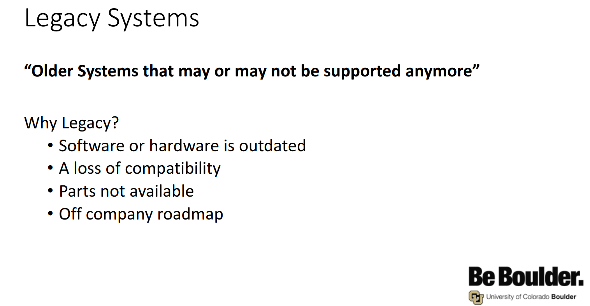
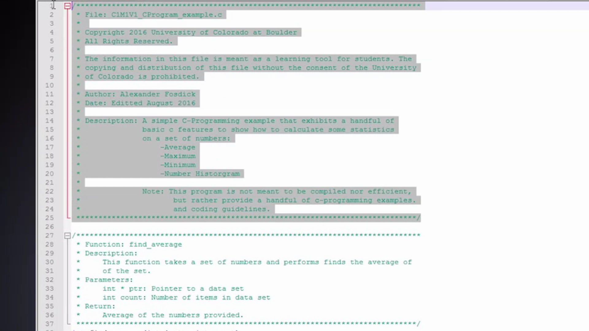

# *In the name of Allah the Merciful*

#  Week 1 - Embedded System Development Components

## Week Objectives
> Define the components of an embedded system  
> Classify the parts of an embedded systems developer’s Source Configuration Management (SCM)  
> Apply Git Version Control to software projects  
> Write a simple programming assignment that prints statistics to the command line using a variety of c-programming operators and features  
> Perform Compilation with GCC and execute output files from the command line  
> Use git Version control to create a repository to version control code.  

## Table of Contents
* [Introduction to Embedded Systems(to be added later)](#--)
* [Embedded Software Engineering(to be added later)](#--)
* [Introduction to Software Configuration Management](#--)
* [C Standardization and Team Coding Standards](#--)
* [Development Environments Overview](#--)
* [Development Kits and Documentation](#--)
* [Version Control](#--)

## Introduction to Software Configuration Management
- SW configuration management (SCM) is the process that handles how we configure and go about developing the code for the project.\
- SCM simply describes how the software is developed and orgainzed 
- This process contains a diverse set of goals and guidelines that dictate the software processes just as:\
  - Version Control\
  - Development Process\
  - Environmental Information\
  - Software Build and Release\
  - Software Review\
  - Testing\
  - Support\
  - Defect Tracking\
  - Task Management\

- These guidelines help coordinating the schedule and deliverables of the team.
- Defining the practices of an SCM is dependent on the company or the team itself, as well as the platform needs. (a team may has some specific testing practices while other team implements all of their code in assembly)
- Version control is a very powerful tool that allows are changes in a software code to be tracked indefinitely, 'version control' is usally combined with 'software review' as a way to prevent poorly designed software configurations into a project.
- As we already know, the embedded system design and development is done using both host machine and target platform, the following image shows some of the important software tools used in the host machine \

- After the executable file is generated from the toolchain, the code is installed on the target platform through the 'programmer debugger' or 'burner' \

- We can simulate and test the code on the host environment before installing the code on the target, but it's also crucial to test the code on the embedded platform
- As the software projects grow heavily (e.g.: as in companies like Apple or Google), they make the guideline so called 'software support', this is to support multiple versions of their product over multiple hardware platforms.
- For example, consider the Apple's iOS support matrix that supports many different ARM core processors and Apple devices with multiple OS versions, some of those devices are not supported anymore and some others are fully supported

- We know that products eventually will retire and become obselete, but we need these obselete products for not only historical information, but also for validation against newer products, we call these old systems 'legacy systems'
- A system becomes 'legacy' if its software or hardware is outdated, the compatibility between the system components is lost, the system parts are not in production any more, or the company has moved off the roadmap and is actually not supporting the product anymore.

- Using the legacy system as lessons learned and reusing them will speed up the development of the future products.

## C Standardization and Team Coding Standards

### C Standardization
- Software languages are evolving over time (just like software applications do), new versions of the same programming language and hence new features will be released, so software teams need to have an understanding of the language version they use, specially if the project is to be maintained for an extended amount of time.
- An important characteristic of a high level language (like the C language) is that it's standardized and protable across platforms.
- The IEEE, ISO, and ANSI are three groups that ivolve with the process of stadardizing, which -in turn- help the engineers creating their portable and maintainable projects without much overhead
- The first unofficial standard of C language was created in the late 1970s, this classic version of C was referred to as 'K&R C' which stands for the standard creators Ken Thompson and Dennis Richie, this standard has some features that are no longer supported in C anymore.
- In 1989, the ANSI-C standard was introduced (also known as C89 standard)
- In 1990, the ISO-C (C90) has come to the light
- In 1999, the C99 came out with some new features (e.g.: the 'inline' keyword which is used heavily in embedded systems).
- In 2011. the C11 is introduced, supporting many features specifically related to multi-threding.
- It's crucial to know about these standards diversion as many compilers can support only specific versions, even some compilers can support only one version of C, so we may be forced sometimes to use particular compilers to get the job done
- However, there are not many differences or changes between the C89 and C99 standards.
- We specify the standard version during compilation process.

### Team Coding Standards
- A coding standards or coding guidelines is simply a list of software guidelines to be followed during the code development throughout the project.
- There maybe a special format and documentation for the code needed, you may need to program the flow of routines in a certain way, how you name files, functions, and variables, etc...
- The importance of the coding standards becomes obvious when a wide range of a team consisting of senior and new hired junior engineers work with each other, needing consistency in the code base to reduce the possibility of syntax bugs or bad practices.
- Another strength point of the coding standards is that it greatly enhances the code readability.
- Can also ensure security, portability, reliability, and safety of software.
- A very common C programming guideline for embedded systems is the Motor Industry Software Reliability Association MISRA-C.
- Another guideline is the Ganssle’s “Firmware Development Standard”
- Also the company's software team can develop their own specific coding guideline based on their requirements.
- Team members come and go over time, but the company must ensure quality and maintainability of their products along their lifetime, that's why the coding guidelines are crucial for them.
- The following image shows a code example written with the Ganssle's firmware development standard

- The above images shows a block of comments at the top of the file that discuss file name, some copyright information, authorship and description of the module. This header section provides the information that can save the developer alot of time tracking down the code.
- The copyright is very important for the software engineer to read and understand, specially when the engineer consider adding third party software in their project.
- Including third party software without checking its copyright can cause major issues, as copyright infringement may lead you to loss of your code ownership and other legal serious issues (e.g.: Cisco systems had to opensource some of their firmware of their products due to a violation of a software foundation license).
- After the heading block of comments comes the function prototype with a very informative commented section, indicating a function description, parameters and return type

- Usually, these comments are only included in the header file, as the header file may be the only thing a software engineer has access to when interfacing with the software which has its implementation files pre-compiled
- Constant information are represented in CAPITAL letters as shown below:

- Indention and new lines are used to help with readability like the array in the above image
- In indention, it's better to use 'spaces' over 'tabs' for consistency as each editor specifies how long a tab actually is.

## Development Environments Overview
- The primary goal of the development environment is to allow developers to write, compile, install, and debug the program
- There are two different desktop environments that can be used in development:
  - The command line interface (CLI) (specially in linux machines)
  - The integrated development environment (IDE)
- Building software project using the CLI is a very useful skill as it gives us a powerful level of control of applications, but at the expense of the user interface.
- In this course, we will deal with the CLI in order to:
  - Edit Code
  - Build
  - Install
  - Debug (will not use it in the course).
- For compilation, we will use GNU toolset to generate the SW executable files.
- Installation and debugging are architecture dependent processes, 'host debugging' can utilize a command line tool called 'GDB' which stands for 'GNU project debugger'
- On target debugging can be done through a 'network debugger' or 'connected hardware debugger'
- The IDE encapsulates all the above complex details and provides a much more interactive user interface to make it easier to finish the job, but since the IDE hides some details from the developer, then it restrics the developer's degrees of freedom which becomes less ideal of them to work with IDEs
- However, IDEs basically run behind the scenes the exact same commands as the commands we use in the CLI, the IDEs have some minor differences for automation purposes that we will consider when we talk about make files later in the course.
- Some basic Debian/Ubuntu Linux command line commands are:
  - pwd ==> shows the location of the present working directory
  - ls ==> list all of the current directories and files that are in the current working directory
  - cd ==> change directory, this command changes the current working directory to another one.
  ** Please note that I'm not focusing on illustratring linux and command line details, so if you are interested in understanding please refer to the course or any linux supplementary material **

