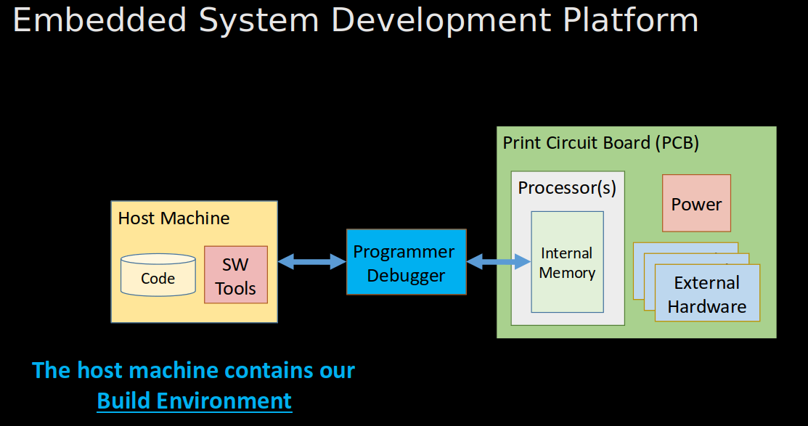
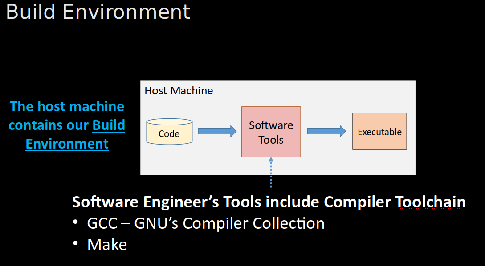
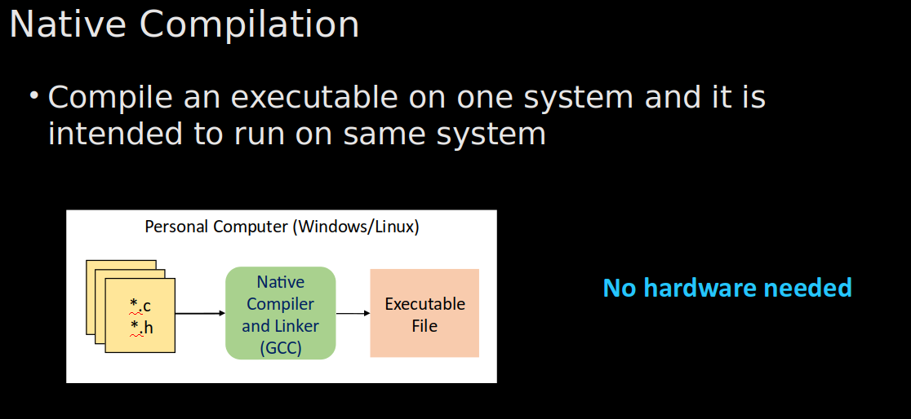
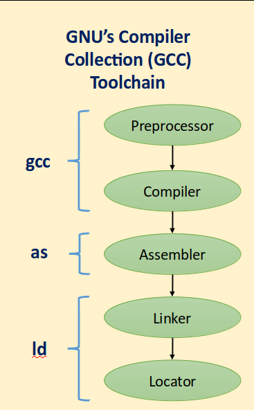
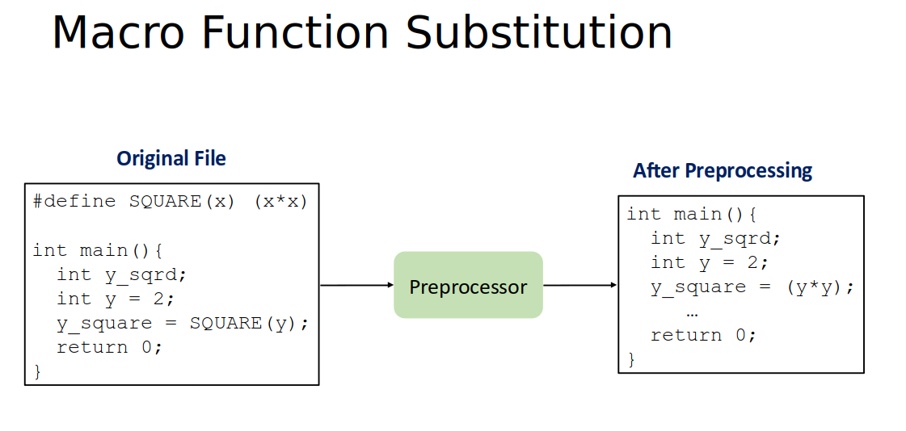
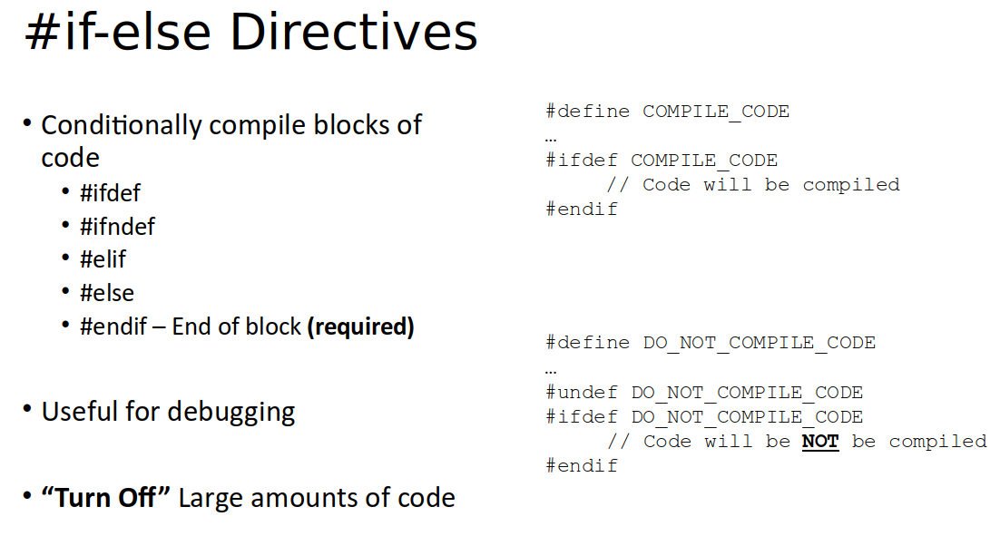
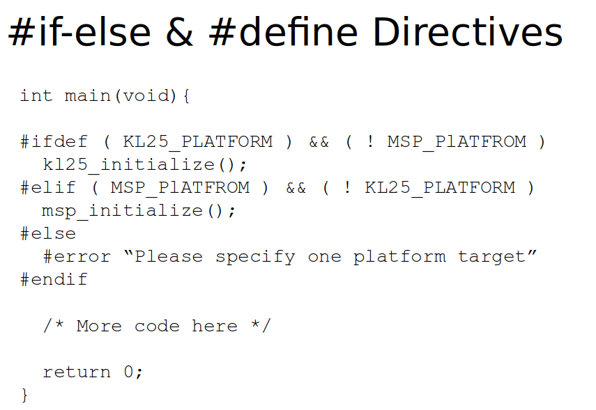
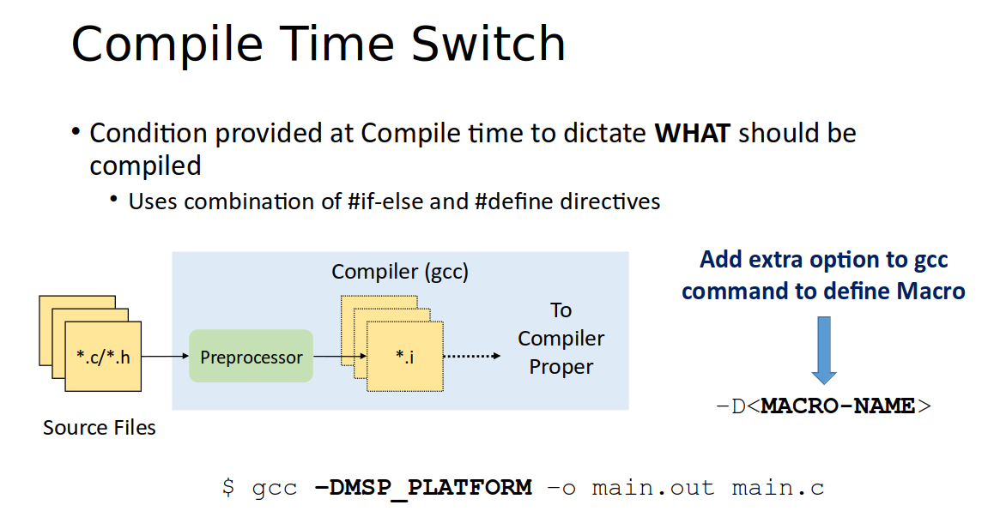

# **In the name of Allah the Merciful**

# Week 2 - Compilation With GCC and GNU Make

## Week Objectives
> Implement a build system using GNU’s Make and GCC compiler toolsets  
> Examine the pre-processor's role in compilation  
> Integrate new libraries to a build system   
> Write a makefile that can natively and cross compile an application  
> Generate preprocessor, assembly, object, dependency, executable, and map output files  

## Table of Contents
* [Introduction to Build Systems Using GNU Toolsets](#--)
* [Compiling and Invoking GCC](#--)
* [Preprocessor Directives](#--)
* [Creating Header and Implementation Files](#--)
* [Linkers](#--)
* [Make and Makefiles](#--)
* [Other Useful GNU Bin Tools](#--)

## Introduction to Build Systems Using GNU Toolsets
- To transform the code written in high level language to the executable form which is written in architecture specific machine code, we use various tools so that each one do its specific job.
- The tools that we use in this course are provided by *GNU's Compiler Collection (GCC)*, GNU bundles many useful compilation tools together, this is what we refer to as (toolchain)
- GCC was developed by a third party as free software. GCC suppports a wide array of architectures including ARM.
- This wide support is important for developers as it allows them to have some flexibility in their platform choice
- In this course, we will use the compiler toolchain on the Ubuntu Linux host machine, and we will investigate the steps of compilation.

- To install the code on the target platform, the high level language (mostly C) is translated into the architecture specific assembly language (which is the low level language), then the assembly is translated into the machine code which is the binary encoded assembly instructions.
- This machine code is what processors understand and use to perform their required jobs.

- The machine code is a binary represented encoded instructions, these instructions can be looked up in the processor's *instruction set architecture (ISA)*
- The compiler toolchain consists of:
  1. Preprocessor
  2. Compiler
  3. Assembler
  4. Linker
  5. Locator
  
  

- Preprocessor takes the source and header files, transforms them to new files after evaluating the preprocessor directives and perform macros substitution, these files will be of extension *.i*. The preprocessor stage is nothing but text replacement.
- Then these files are fed into the compiler to translate the code from C language to Assembly language. The compiler output files are of extension *.s or .asm*
- After that, the assembly files are fed into the assembler to translate from assembly into object code which is not human readable. The assembler output files are of extension *.o*
- Now we have multiple object files, so we feed them to the linker in order to resolve all references (aka.: symbols) between object files, and combine all the *.o* files into a single executable file called *relocatable file*
- Finally, the relocatable file is fed into the locator which will map all the virtual addresses of code and data into the processor's physical memory space, and generates the final executable file which will be installed on the target.
- Once we compile a project, the executable will only work on the architecture we compiled for, so it can't run on other systems even on the host machine itself.
- The latter point leads us to compare between native compilation and cross compilation:
  > - Native compilation: it's when you compile your project for the same system you intend to run the executable on (e.g.: the programs that run on PC)
  > 
  > - Cross compilation: is when you compile your project on a system that is intended to run on another system (this is our case in embedded systems). Here we need a hardware circuit to install the executable from the host machine to the target.
  > 
- We use cross compilation for embedded systems as the microcontroller doesn't have neither the operating system nor the resources for programs like GCC to be installed and perform the build process. Maybe some advanced machines such as the ARM cortex-A processors can have the resources to perform native compilation.
- We may not need an external HW circuit to install the executable on the target as the board may have an internal on-board programmer/debugger like the one in the following image:
 
 
 - Building large software projects can be tedious (boring) as managing a large number of files for compilation with all their respective compile options becomes very slow. That's why we need an automated way to manage this process.
 - GNU Make is a tool that controls the generation of executables and other non source files of the program, and helps us managing the whole process of building, specially for large projects.
 - Mastering how to use the build tools will prove immensly valuable in industry and in our own projects.
 
## Compiling and Invoking GCC
- In this lesson, we will use GCC to build the system through command line interface.
- Recall the GCC toolchain:

- The preprocessor and compiler are invoked with the `gcc` command
- Assembler is invoked by the `as` command
- Linker and locator are invoked by the `ld` command
- However, we can perform the whole build process using the `gcc` command directly
- Many compiler toolchains can be installed on the host machine, we can list the installed toolchains using the command `ls -la /usr/bin/*gcc`
- The installed toolchains are named in a specific format:
  1. The architecture name
  2. The vendor name
  3. The OS name
  4. The Application Binary Interface (ABI)
- Consider the following example:

- The 2 ARM compilers listed in the image above are cross compilers for 2 different architecture targets, one of them is for an embedded system with a Linux OS installed and the other is for a bare-metal embedded target
- Note: bare-metal firmware means to write code directly to interface with hardware
- In the above image, we can also see a native compiler installed which is `gcc-4.8`
- We can see all the tools installed inside the cross-compiler toolchain (for example: arm-non-eabi toolchains) using the command `ls -la /usr/bin/arm-none-eabi*`

- Only one gcc compiler is activated although we may see many compilers are installed, to know which version of gcc is the activated version we type `gcc --version`
- The command `which gcc` tells you the location of installation of the activated gcc
- Regarding the assembler process, as we stated before, the assembler converts the assembly instruction into binary encoded operations, these binary encoded operations are referred to as *operation codes* or *op-codes*, some op-codes also have some associated information about the operands or the data they are operating on

- The `gcc` command will always have the form: `gcc [OPTIONS] [FILES]`, the options that we provide are for giving specific instructions on how to compile the required files
- The following image contains some important options to know: (for the full options description please refer to the $$$$$)

- The command `gcc -std=c99 -Werror -o main.out main.c` will compile and link the file (main.c) using the C99 standardization, the `-o` option is to save the output executalbe into a file named (main.out), and the (-Werror) flag is used for a quality driven software so that it will cause compilation to fail if any warnings occur.
- We can use the `-Werror` flag to prevent developers from building software without resolving all of their warning messages first, as some unresolved warnings may introduce bugs.
- The `-v` flag may be used to tell the compiler to output more logging information
- Important note: when we invoke the GCC this way, then it will automatically search it's own libraries that are included in the source code to be compiled (for example: the stdio library which exists in the GCC included path)
- Jumping to the execution process, the main funtion is not actually the entry point into the application, there is an initialization code that is compiled and run before the main function and this code is the one responsible for invoking the main function. This code is also responsible for cleaning up the application and exiting after the main returns.
- As we have general flags for GCC whether it's native or cross compiler, we also have other architecture specific compiler flags for ARM cross compilers that are shown below:

- **These architecture flags are important for informing the compiler and the linker about specific libraries to include as well as the target architecture and CPU to cross-compile for.**
- For example: consider this command to generate the embedded architecture specific assembly file `arm-none-eabi-gcc -std=c99 -mcpu=cortex-m0plus -mthumb -Wall -S main.c -o main.s` ... we can add the `-g` flag to add debug symbols for the assembly file.
- Also consider this to generate the main.out file: `arm-none-eabi-gcc main.c -o main.out --specs=nosys.specs -std=c99 -mcpu=cortex-m0plus -mthumb -Werror`
- If we try to execute the latter main.out file on our host machine it will fail as it's compiled for another system.

## Preprocessor Directives
- The preprocessor doesn't do any translation or any generation of architecture specific code, instead it helps us providing specific control of compilation within files.
- We can consider the preprocessor as a text replacement tool (or search and replace), so it provides us with macros that can help with code reuse and readability.
- The preprocessor provides special keywords called preprocessor directives. Directives start with the `#` sign. 
- Directives can be used to define `constants` as well as `macro functions` 
- Some important directives to discuss are shown in the list below:
  - `#define`, `#undef` 
  - `#ifndef`, `#ifdef`, `#endif`
  - `#include`
  - `#warning`, `#error` --> for stopping or printing warning messages in compilation.
  - `#pragma`--> this directive allows us to provide instructions to the compiler through the code itself rather than the command line.
  
- Command to stop the build process just after the preprocessing stage and generate a '.i' file: `gcc -E -o file.i file.c`
- When we look at the file.i we will find that the declarations, definitions of '#define' and files that are to be included have been added to the top of the file.
- `#define` use cases:
  > - We don't want to place random constants all over the code, it's a lot better, more readable and maintainable, and easier to modify if we #define all constants at the top of the file. The **macro variables** are defined with the statement: `#define <MACRO-NAME> <MACRO-VALUE>` .. the <MACRO-VALUE> may be a constant, a string, or even a C statement.
  
  
  
  > - We may want to make **macro functions**, suppose we have a specific maths formula that we use regularly in our code, so we decide that it will be better to replace the function which is doing this operation over and over with overheads like the context switching and so on with a **macro function** .. we do so using the statement `#define <MACRO-FUNCTION>(<PARAMETERS>) (<C_OPERATIONS>)` .. consider the following example:
   
   
  
  
  > - On the other side, if there is a bug in the macros, it will be harder to find and resolve as we usually don't examine the .i files. For example consider the following example:
   
  
  > The code was meant to output y_square to 4, but due to this bug it has multiplied 2\*3 and the result became 6. This is because we forgot the fact that preprocessor directives only make text replacements, we provided an input to the function as a valid operation to the compiler but it's not the same perspective as the preprocesor which has made text replacement twice and led us to undefined behavior.
  
  > - We can define a macro without any value, we use this way as a true/false condition of whether a certain feature is represented or not. We do so by the statement `#define <FEATURE-NAME>`. This use case can be used with the `#ifdef` & `#ifndef` to perform **compile time switches**
   
   
- Conditional directives use cases:
  - The conditional directives may be:
    - #ifdef
    - #ifndef
    - #if
    - #elif
    - #else
    - #endif --> crucial to end every block of the conditional directives
  - These directives can turn off large amounts of unneeded code, we can use them along side the `#define` & `#undef` to perform **compile time switches**, for example if we are writing a generic code for various microcontroller devices, then we can use these directives to include the header file of just the specific microcontroller device we need
  - These directives are useful for debugging
  - The if-else directives are just like the if-else in C programming, except that we don't provide the brackets `{....}`and instead we end the block with the `#endif`
   
   
   
 - `#include` use cases:
   
   For example, in the following image the preprocessed file now contains the contents of both the .c & .h files:
   

- `#pragma` use cases:
  - It's used to provide specific instructions for the compiler from the code itself, not the command line.
  - It's important when we want to provide a specific option for a specific piece of code that general compile options shouldn't do
  - It's compiler specific, meaning that some compilers can respond to the #pragma and some others may not recognize the instruction so the compiler igonre it.
  - In embedded systems, we avoid using some functions that are known to be costly resourced (like the printf), so we use the `poison` option to enforce the developer not to use these functions or an error will occur.
   
   

- We mentioned the term **compile time switch** before, let's discuss it in more details:
  - The compile time switches are conditional blocks of code that can change which block is executed based on a runtime parameter (the #define <--->)
  - We may add the macro name to be defined from the command line itself without modifying the code. We do so by adding the option `-D<MACRO-NAME>` and please note that the <MACRO-NAME> comes immediately after the -D ... this is equavalent to defining the macro in one of the source or header files
  
  
  - As we mentioned before, the compile time switch allows us to use the same code for different embedded platforms, in the following image we have the same application installed on different hardware platforms with similar software except for the UART_Lib, thanks to the compile time switches we can easily provide a very portable top layer of software with a very flexible firmware layer so that we compile the same code for two different hardware targets.
  
   
   
- The pros of preprocessor directives:
  - They make less overhead than the typical code
  - Make great improvement for writing maintainable, readable, and platform independent programs.
  
- The cons of preprocessor directives:
  - They don't perform type checking
  - They may increase bugs
  - They increase the code size
