# **In the name of Allah the Merciful**

# Week 2 - Compilation With GCC and GNU Make

## Week Objectives
> Implement a build system using GNU’s Make and GCC compiler toolsets  
> Examine the pre-processor's role in compilation  
> Integrate new libraries to a build system   
> Write a makefile that can natively and cross compile an application  
> Generate preprocessor, assembly, object, dependency, executable, and map output files  

## Table of Contents
* [Introduction to Build Systems Using GNU Toolsets](#--)
* [Compiling and Invoking GCC](#--)
* [Preprocessor Directives](#--)
* [Creating Header and Implementation Files](#--)
* [Linkers](#--)
* [Make and Makefiles](#--)
* [Other Useful GNU Bin Tools](#--)

## Introduction to Build Systems Using GNU Toolsets
- To transform the code written in high level language to the executable form which is written in architecture specific machine code, we use various tools so that each one do its specific job.
- The tools that we use in this course are provided by *GNU's Compiler Collection (GCC)*, GNU bundles many useful compilation tools together, this is what we refer to as (toolchain)
- GCC was developed by a third party as free software. GCC suppports a wide array of architectures including ARM.
- This wide support is important for developers as it allows them to have some flexibility in their platform choice
- In this course, we will use the compiler toolchain on the Ubuntu Linux host machine, and we will investigate the steps of compilation.

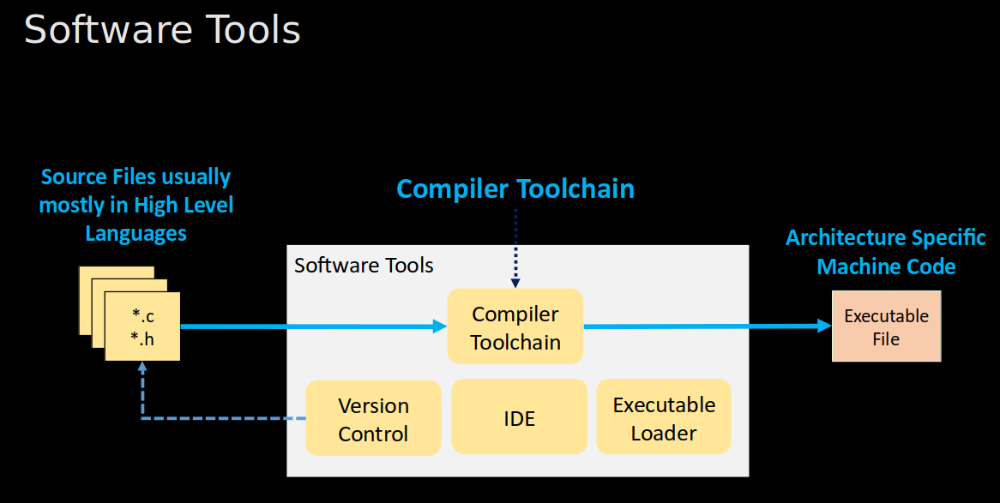

- To install the code on the target platform, the high level language (mostly C) is translated into the architecture specific assembly language (which is the low level language), then the assembly is translated into the machine code which is the binary encoded assembly instructions.
- This machine code is what processors understand and use to perform their required jobs.
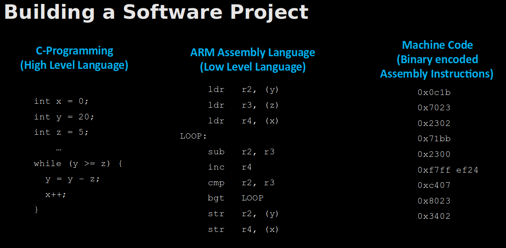

- The machine code is a binary represented encoded instructions, these instructions can be looked up in the processor's *instruction set architecture (ISA)*
- The compiler toolchain consists of:
  1. Preprocessor
  2. Compiler
  3. Assembler
  4. Linker
  5. Locator
  
  

- Preprocessor takes the source and header files, transforms them to new files after evaluating the preprocessor directives and perform macros substitution, these files will be of extension *.i*. The preprocessor stage is nothing but text replacement.
- Then these files are fed into the compiler to translate the code from C language to Assembly language. The compiler output files are of extension *.s or .asm*
- After that, the assembly files are fed into the assembler to translate from assembly into object code which is not human readable. The assembler output files are of extension *.o*
- Now we have multiple object files, so we feed them to the linker in order to resolve all references (aka.: symbols) between object files, and combine all the *.o* files into a single executable file called *relocatable file*
- Finally, the relocatable file is fed into the locator which will map all the virtual addresses of code and data into the processor's physical memory space, and generates the final executable file which will be installed on the target.
- Once we compile a project, the executable will only work on the architecture we compiled for, so it can't run on other systems even on the host machine itself.
- The latter point leads us to compare between native compilation and cross compilation:
  > - Native compilation: it's when you compile your project for the same system you intend to run the executable on (e.g.: the programs that run on PC)
  > 
  > - Cross compilation: is when you compile your project on a system that is intended to run on another system (this is our case in embedded systems). Here we need a hardware circuit to install the executable from the host machine to the target.
  > 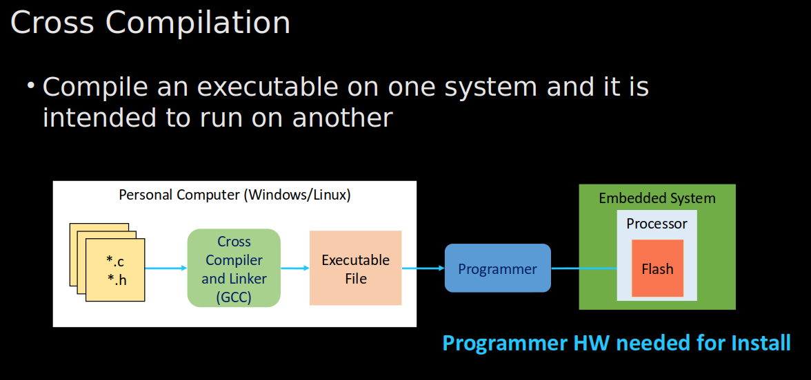
- We use cross compilation for embedded systems as the microcontroller doesn't have neither the operating system nor the resources for programs like GCC to be installed and perform the build process. Maybe some advanced machines such as the ARM cortex-A processors can have the resources to perform native compilation.
- We may not need an external HW circuit to install the executable on the target as the board may have an internal on-board programmer/debugger like the one in the following image:
 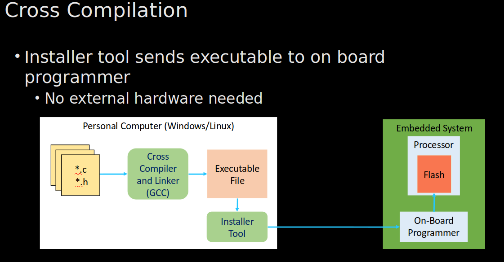
 
 - Building large software projects can be tedious (boring) as managing a large number of files for compilation with all their respective compile options becomes very slow. That's why we need an automated way to manage this process.
 - GNU Make is a tool that controls the generation of executables and other non source files of the program, and helps us managing the whole process of building, specially for large projects.
 - Mastering how to use the build tools will prove immensly valuable in industry and in our own projects.
 
## Compiling and Invoking GCC
- In this lesson, we will use GCC to build the system through command line interface.
- Recall the GCC toolchain:

- The preprocessor and compiler are invoked with the `gcc` command
- Assembler is invoked by the `as` command
- Linker and locator are invoked by the `ld` command
- However, we can perform the whole build process using the `gcc` command directly
- Many compiler toolchains can be installed on the host machine, we can list the installed toolchains using the command `ls -la /usr/bin/*gcc`
- The installed toolchains are named in a specific format:
  1. The architecture name
  2. The vendor name
  3. The OS name
  4. The Application Binary Interface (ABI)
- Consider the following example:

- The 2 ARM compilers listed in the image above are cross compilers for 2 different architecture targets, one of them is for an embedded system with a Linux OS installed and the other is for a bare-metal embedded target
- Note: bare-metal firmware means to write code directly to interface with hardware
- In the above image, we can also see a native compiler installed which is `gcc-4.8`
- We can see all the tools installed inside the cross-compiler toolchain (for example: arm-non-eabi toolchains) using the command `ls -la /usr/bin/arm-none-eabi*`
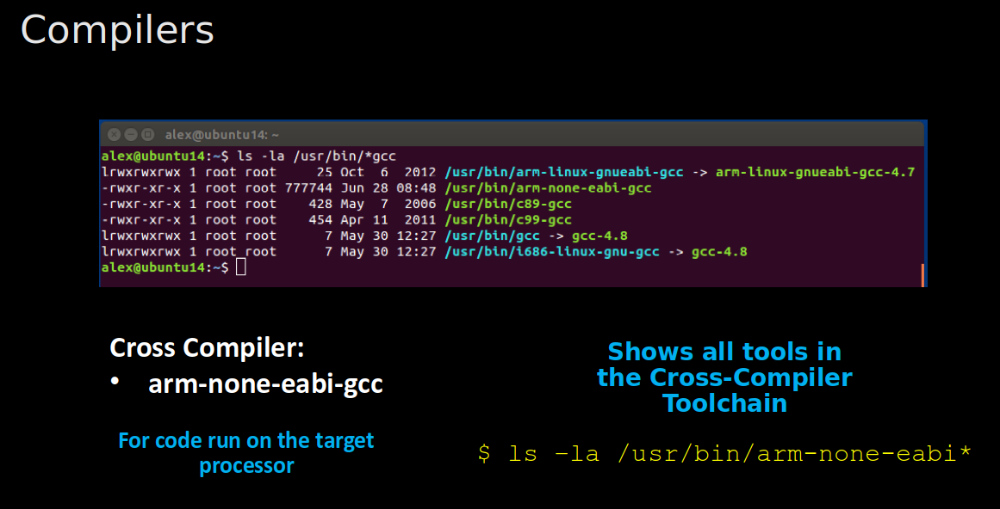
- Only one gcc compiler is activated although we may see many compilers are installed, to know which version of gcc is the activated version we type `gcc --version`
- The command `which gcc` tells you the location of installation of the activated gcc
- Regarding the assembler process, as we stated before, the assembler converts the assembly instruction into binary encoded operations, these binary encoded operations are referred to as *operation codes* or *op-codes*, some op-codes also have some associated information about the operands or the data they are operating on

- The `gcc` command will always have the form: `gcc [OPTIONS] [FILES]`, the options that we provide are for giving specific instructions on how to compile the required files
- The following image contains some important options to know: (for the full options description please refer to the $$$$$)

- The command `gcc -std=c99 -Werror -o main.out main.c` will compile and link the file (main.c) using the C99 standardization, the `-o` option is to save the output executalbe into a file named (main.out), and the (-Werror) flag is used for a quality driven software so that it will cause compilation to fail if any warnings occur.
- We can use the `-Werror` flag to prevent developers from building software without resolving all of their warning messages first, as some unresolved warnings may introduce bugs.
- The `-v` flag may be used to tell the compiler to output more logging information
- Important note: when we invoke the GCC this way, then it will automatically search it's own libraries that are included in the source code to be compiled (for example: the stdio library which exists in the GCC included path)
- Jumping to the execution process, the main funtion is not actually the entry point into the application, there is an initialization code that is compiled and run before the main function and this code is the one responsible for invoking the main function. This code is also responsible for cleaning up the application and exiting after the main returns.
- As we have general flags for GCC whether it's native or cross compiler, we also have other architecture specific compiler flags for ARM cross compilers that are shown below:

- **These architecture flags are important for informing the compiler and the linker about specific libraries to include as well as the target architecture and CPU to cross-compile for.**
- For example: consider this command to generate the embedded architecture specific assembly file `arm-none-eabi-gcc -std=c99 -mcpu=cortex-m0plus -mthumb -Wall -S main.c -o main.s` ... we can add the `-g` flag to add debug symbols for the assembly file.
- Also consider this to generate the main.out file: `arm-none-eabi-gcc main.c -o main.out --specs=nosys.specs -std=c99 -mcpu=cortex-m0plus -mthumb -Werror`
- If we try to execute the latter main.out file on our host machine it will fail as it's compiled for another system.

## Preprocessor Directives
- The preprocessor doesn't do any translation or any generation of architecture specific code, instead it helps us providing specific control of compilation within files.
- We can consider the preprocessor as a text replacement tool (or search and replace), so it provides us with macros that can help with code reuse and readability.
- The preprocessor provides special keywords called preprocessor directives. Directives start with the `#` sign. 
- Directives can be used to define `constants` as well as `macro functions` 
- Some important directives to discuss are shown in the list below:
  - `#define`, `#undef` 
  - `#ifndef`, `#ifdef`, `#endif`
  - `#include`
  - `#warning`, `#error` --> for stopping or printing warning messages in compilation.
  - `#pragma`--> this directive allows us to provide instructions to the compiler through the code itself rather than the command line.
  
- Command to stop the build process just after the preprocessing stage and generate a '.i' file: `gcc -E -o file.i file.c`
- When we look at the file.i we will find that the declarations, definitions of '#define' and files that are to be included have been added to the top of the file.
- `#define` use cases:
  > - We don't want to place random constants all over the code, it's a lot better, more readable and maintainable, and easier to modify if we #define all constants at the top of the file. The **macro variables** are defined with the statement: `#define <MACRO-NAME> <MACRO-VALUE>` .. the <MACRO-VALUE> may be a constant, a string, or even a C statement.
  
  
  
  > - We may want to make **macro functions**, suppose we have a specific maths formula that we use regularly in our code, so we decide that it will be better to replace the function which is doing this operation over and over with overheads like the context switching and so on with a **macro function** .. we do so using the statement `#define <MACRO-FUNCTION>(<PARAMETERS>) (<C_OPERATIONS>)` .. consider the following example:
   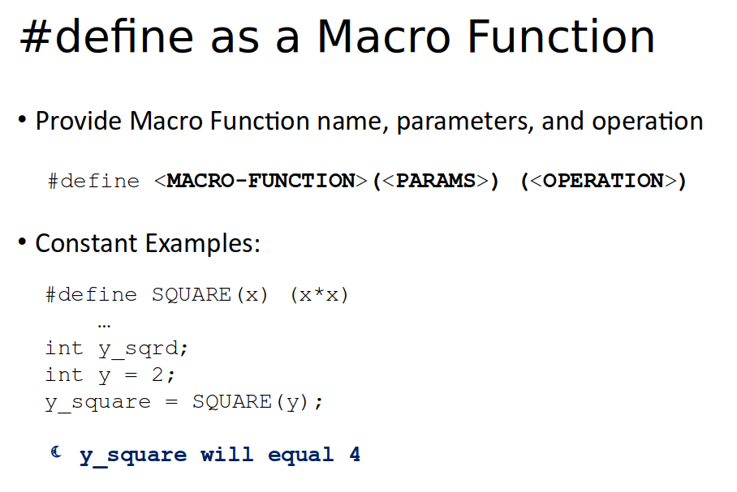
   
  
  
  > - On the other side, if there is a bug in the macros, it will be harder to find and resolve as we usually don't examine the .i files. For example consider the following example:
   
  
  > The code was meant to output y_square to 4, but due to this bug it has multiplied 2\*3 and the result became 6. This is because we forgot the fact that preprocessor directives only make text replacements, we provided an input to the function as a valid operation to the compiler but it's not the same perspective as the preprocesor which has made text replacement twice and led us to undefined behavior.
  
  > - We can define a macro without any value, we use this way as a true/false condition of whether a certain feature is represented or not. We do so by the statement `#define <FEATURE-NAME>`. This use case can be used with the `#ifdef` & `#ifndef` to perform **compile time switches**
   
   
- Conditional directives use cases:
  - The conditional directives may be:
    - #ifdef
    - #ifndef
    - #if
    - #elif
    - #else
    - #endif --> crucial to end every block of the conditional directives
  - These directives can turn off large amounts of unneeded code, we can use them along side the `#define` & `#undef` to perform **compile time switches**, for example if we are writing a generic code for various microcontroller devices, then we can use these directives to include the header file of just the specific microcontroller device we need
  - These directives are useful for debugging
  - The if-else directives are just like the if-else in C programming, except that we don't provide the brackets `{....}`and instead we end the block with the `#endif`
   
   
   
 - `#include` use cases:
   
   For example, in the following image the preprocessed file now contains the contents of both the .c & .h files:
   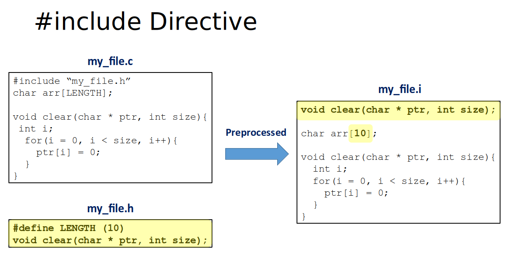

- `#pragma` use cases:
  - It's used to provide specific instructions for the compiler from the code itself, not the command line.
  - It's important when we want to provide a specific option for a specific piece of code that general compile options shouldn't do
  - It's compiler specific, meaning that some compilers can respond to the #pragma and some others may not recognize the instruction so the compiler igonre it.
  - In embedded systems, we avoid using some functions that are known to be costly resourceful (like the printf), so we use the `poison` option to enforce the developer not to use these functions or an error will occur.
   
   

- We mentioned the term **compile time switch** before, let's discuss it in more details:
  - The compile time switches are conditional blocks of code that can change which block is executed based on a runtime parameter (the #define <--->)
  - We may add the macro name to be defined from the command line itself without modifying the code. We do so by adding the option `-D<MACRO-NAME>` and please note that the <MACRO-NAME> comes immediately after the -D ... this is equavalent to defining the macro in one of the source or header files
  
  
  - As we mentioned before, the compile time switch allows us to use the same code for different embedded platforms, in the following image we have the same application installed on different hardware platforms with similar software except for the UART_Lib, thanks to the compile time switches we can easily provide a very portable top layer of software with a very flexible firmware layer so that we compile the same code for two different hardware targets.
  
   
   
- The pros of preprocessor directives:
  - They make less overhead than the typical code
  - Make great improvement for writing maintainable, readable, and platform independent programs.
  
- The cons of preprocessor directives:
  - They don't perform type checking
  - They may increase bugs
  - They increase the code size

## Creating Header and Implementation Files
- Library: is a collection of sotware, either as a source code or a precompiled code format
- A standard library is a pre-written code that is pre-compiled and provided by the toolchain, we don't have access to the source code itself although we can include it in our own projects.
- The standard libraries provided in the compiler toolchain will likely be pretty optimized for the ISA we are using, meaning that they may not be optimized for our specific platform. Remember that we have very limited resources in embedded systems like memory and hardware blocks, that's why some organizations may at some point choose to rewrite some functions from these libraries in order not to include the whole standard library. 
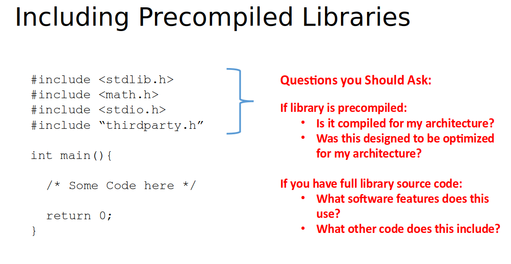
- We may design our own libraries to create reusable modules across different software projects
- Module: is a SW organization so that each module encapsulates certain functionalities.
- We want to design our projects in pieces or blocks to help split up the work and ease the validation process by writing software tests for each separate block or module (which is called *unit test*).
- Each module contains 2 files:
  1. The implementation or source file (.c) that contains functions definitions and other C codes. 
  2. The header file (.h) which contains functions declarations, macros and the derived datatype definitions like the *enums* and *structures*
- The .c file shouln't be directly accessible by SW projects, if we want certain data (e.g.: a certain variable) to be directly accessible we should declare them in the .h file. We can think of this as hiding the private implementation details of the C file, making the header file is the main access point and the documentation source of the module.
- Each header file should begin with the *include guard* in order to prevent more than one include of the same file in the project. This is important as if the compiler sees certain symbols are redefined it will invoke a compilation error
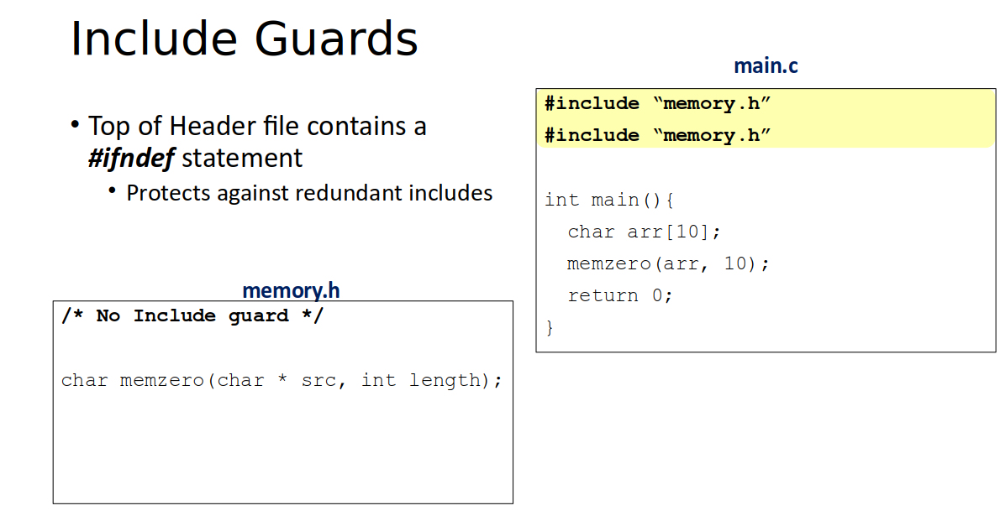

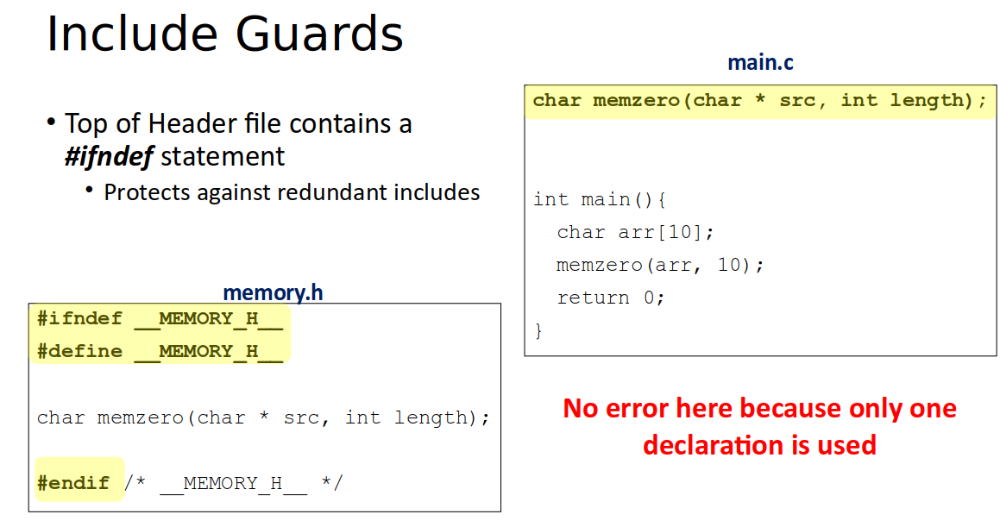

- We can use an alternative include guard rather than the `#ifndef - #define` which is the `#pragma once` but as we mentioned before that the `#pragma` directives are non-standard and non-portable directives so it has its disadvantages.

- Now, we discuss some naming conventions that help maintaining and reading the code much easier:
  - When we define our own module (the .c and .h files), give each module a good name related to its functionality (e.g: keypad.c & keypad.h)
  - Give the associating include guard preprocessor directive a similar name as the module name but in which all letters are capital (e.g.: #ifndef __KEYPAD_H__)
  - Make the header file descriptive by providing a desription of the information it covers at the top of the file (like the module description, author information, copyrights, ...)
  - Also, functions prototypes need informative comments on how to use each function (as in the following image)
 
 
- Back to the pre-compiled libraries, we have 2 types of these libraries:
  - Static libraries: the libraries that are directly linked into the output executable at compile time (an example of this kind of pre-compiled libraries is the standard libraries that are provided with the toolchain)
    - Static libraries can be created using the *archiever* GNU tool (ar)
     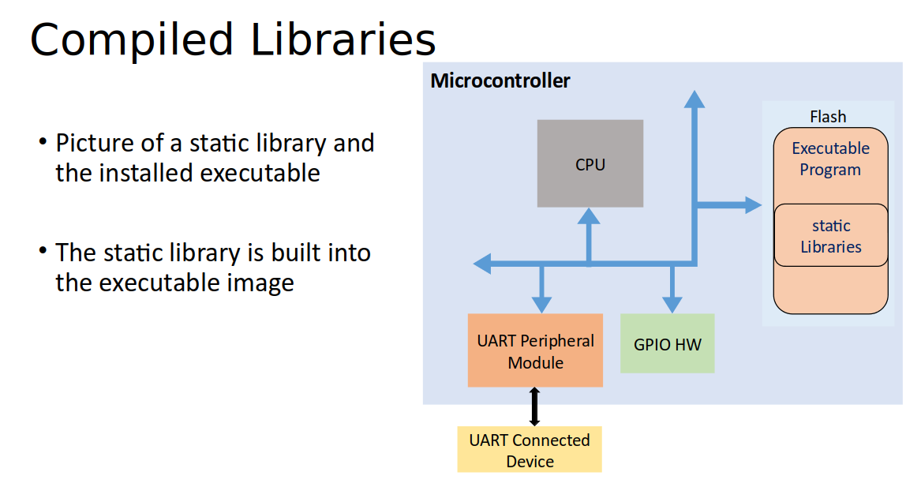
  - Shared libraries: libraries that are linked dynamically with the executable at runtime, meaning that the executable file is placed in separate memory regions than the shared libraries (i.e.: The shared libraries do exist in the platform memory already, and are not installed with the executable)
    - The shared libraries are typically used by architectures running multiple programs using the same library like the advanced architectures that run an embedded operating system
    - Some embedded manufacturers provide a specific section of memory dedicated to store precompiled libraries on the hardware
    - If we install a shared library on our embedded system, then we should save it in a region of memory that will not be overwritten
    - We can create shared libraries with the `shared` option from GCC
     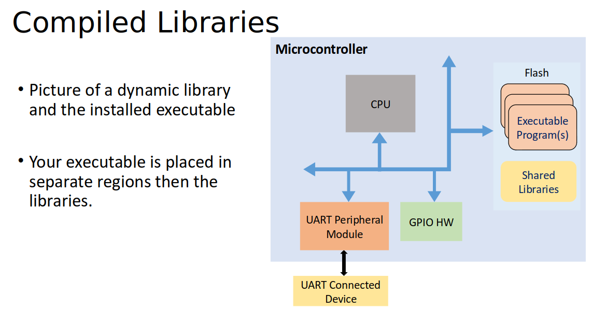
- Designing libraries effectively is an important software architecture paradigm. We should take time to think through code design before trying to write any implementation. Things like how our codes will interface with each other, the purpose of the modules,and the purpose of the functions. So we have to ask ourselves some questions regarding the project design:
  - Where do we actually create the architecture dependances? is it set in the code? or in the command line? .. the choice is up to the designer as there is no answer is better than the other.
  - An example of the latter point: Imagine we have a build system that supports two boards with two different micro controllers, an MSP and KL25Z.
  We have a main file that we want to be architecture independent. So, it includes an intermediate header file called platform.h.
  This platform file helps us selecting between the two different architectures we support based on a compile time switch.
  Each included file in the platform.h contains architecture dependent, low-level interface information for our intended target.
  Given the switch, the correct architecture gets included. This method requires us to create the same function name interface for both the architecture specific files, so that higher levels are compatible with the initialized function.
  There are other options to perform this architecture dependent compilation by putting compiled times switches directly in the codeinstead of intermediate files, or even using version control to help create different file trees.
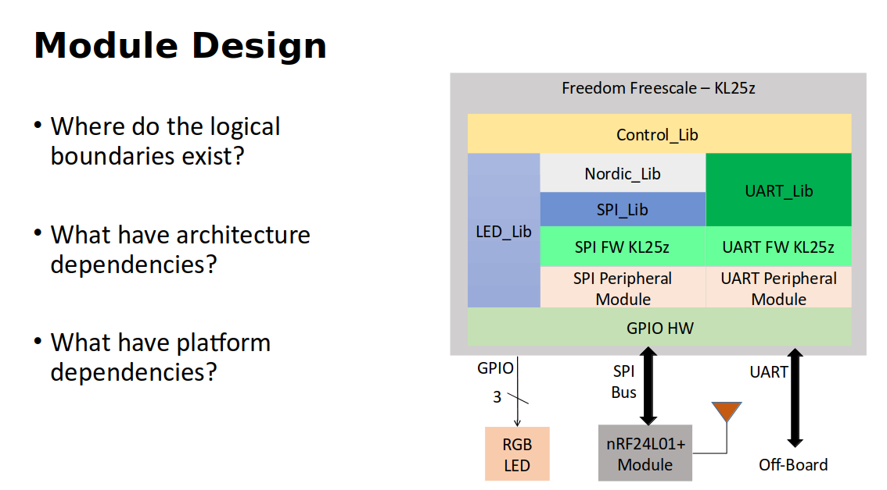

- The following image illustrates how we can perform compile time switches between different platforms

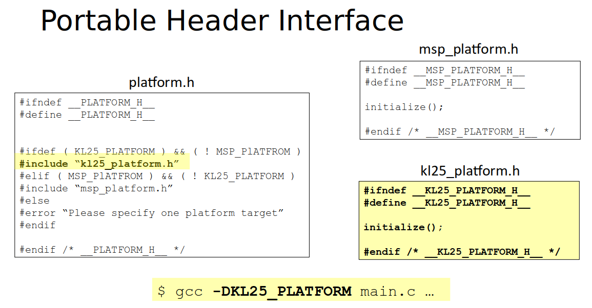

## Linkers
- The process of linking and locating are typically done in one stage and it's the last stage of the building process.
- Remember that the linker's job is to take the compiled object files (which are not executable yet) and combine them to a single executable file, and the locator maps the object file contents into specifc address locations, producing an executable program that can be installed into the embedded microprocessor.
- Normally, we have multiple files that go through the building process, some of them are the typical *.c and .h files*, some are *assembly files (.s)* and some are *library files (.a)*. The first and second types of those files go through their specific path to generate their corresponding *object file (.o)*, then all those object files as well as the .a files are fed to the linker to combine them together into a single object file which in turn is fed into the locator to map the file contents into the memory regions
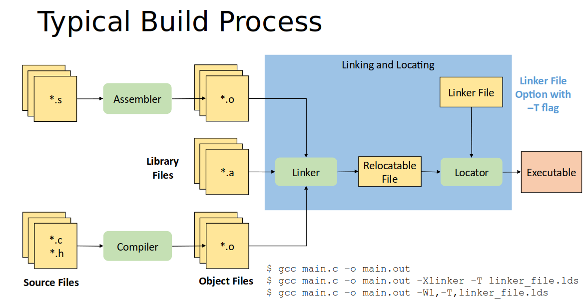

- The **linker file** is the file responsible for telling the linker/locator how to map the executable file into the proper addresses. We pass the linker file through command line with the `-T` flag.

- The linker can be invoked directly by the `ld` or indirectly from the `gcc -o` command
- Linking process is not as simple as appending the contents of some object files into one file, as each object file contains different types of code, each type is stored in a specific memory region (e.g.: code memory and data memory) so each type is managed differently by the linker.
- The code we design is likely written with many modules, defining many functions and variables, these functions and variables are likely used across many other files. For example, consider a module called "memory", this module has a defined function called "memzero", this function is called in the main.c file. The compiler and assembler don't know that this "memzero" function is declared and defined in the "memory" module so that the "memzero" in main.c is just a *symbol* in the compiler's perspective.
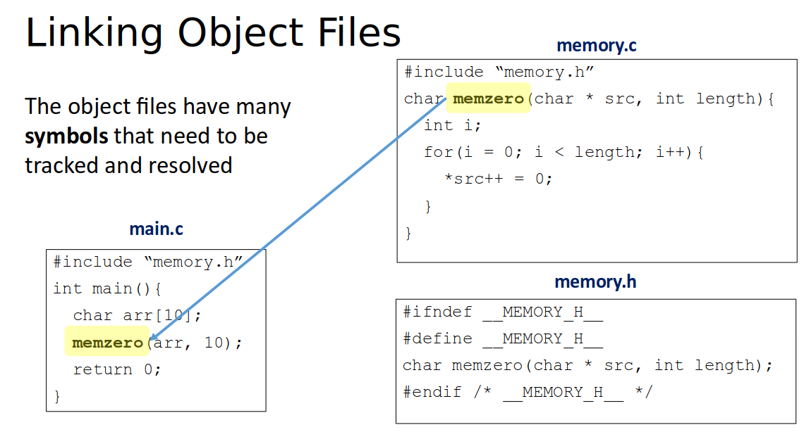

- The symbols defined in one file and used in another file need to be mapped so that the location of the symbol's address is known and assigned properly to all uses of that symbol, the linker does this mapping but without assigning the proper addresses

- The locator is the tool responsible for assigning the proper addresses of the symbols

- Errors occur when we don't properly declare or include a symbol definition that is called somewhere in the project files, in this case the linker will search through all of the object files trying to find that symbol to map it as we discussed before and ofcourse it won't be found as this symbol isn't created, then it will try to search through the included library paths to find that symbol, if it is not found then the linker will throw an error and exit. (consider the example shown in the image below)

- Pre-compiled static libraries will directly be linked to the executable at the linking process (we need to provide the `-l` or `-L`flag to include these libraries).
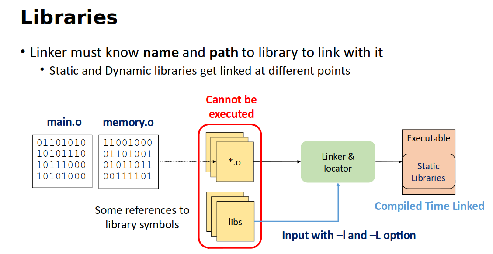

- However, dynamically linked symbols will contain paths to dynamic libraries that are already installed on the target. This causes issues if there was an incompatibility of the library that is installed on the target and the library headers we are including.
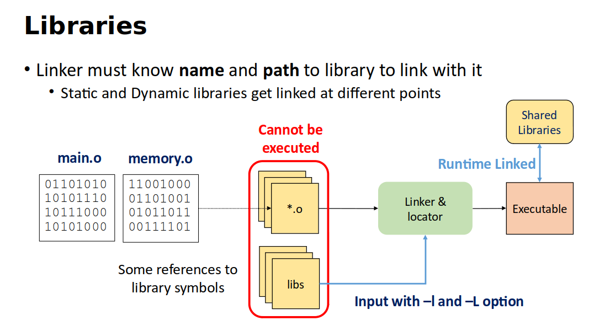

- If we are writing code for an embedded OS platform, then there are likely libraries already installed on the target, so there is no reason to statically compile and upload them again and waste memory space.
- It's worthy to know that standard libraries can be statically or dynamically linked.
- You will likely use static and dynamic linking at one point in your career so it's good to know about them.

- We should also wonder about the question of *What happens before `main` is called and how do we exit or return from the `main` function?" 
  - The answer is that there is a startup routine that runs before the main function, the main is actually invoked in this **startup code**
  - The startup code is usually defined in some C standard libraries and is automatically included in the build process (by the linker) as a static library. (when we directly invoke the linker instead of letting GCC do it's mission from the beginning, then the linker won't link the startup code, and the application won't find the entry for main and other startup instructions, throwing a compilation error). So if we invoke the linker directly, we will have to manually give it these libraries in order to finish the job properly.
  - We can also tell GCC to stop making automatic include to the startup code, we do so if we want to write our own custom startup code (we can do this by providing the `-nostdlib` flag in command line)
  - We can use the *verbose* flag `-v-` to see more details of the compilation and linking processes
- After all linking is done and a final object file has been created with all symbols resolved, the output is called a *relocatable file* and is fed into the *locator* in order to assign the addresses as discussed at the beginning of this lesson.
- The locator takes the relocatable file (which contains many sub-segments of code blocks which need to be mapped into the architecture's specific memory regions by assigning a specific address to each symbol (recall the following 2 images again:)

- Each architecture is very different from others, so the locator needs a special file to provide instructions about how to assign architecture specific addresses to the generic object file. This special file is called *linker file* or *linker script*
- Linker file provides the locator with information on where are the physical memory regions of the processor that will interface with the defined code regions. Linker file is architecture dependant
- Linker file specifies details such as:
  - segment name
  - region name
  - memory sizes
    - We need to assign the exact start address of the data and code memory (origin), and also the memory length of each segment (length)
  - access permission
    - Each memory region specifies access permission such as read (R), write (W), and execute (X) for memory blocks
  A brief example is shown in the following image (will discuss it in more details in Week 3)

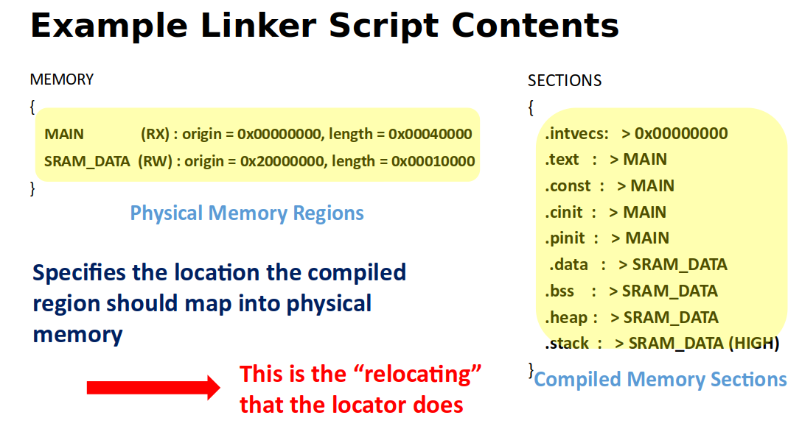
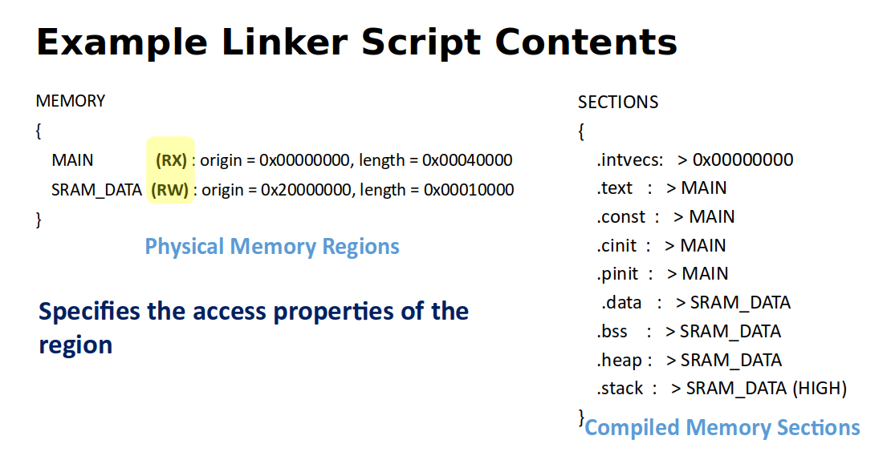

- It's obvious that the total size of memory segments provided in the linker file must be greater than or equal the total compiled code and data sections. To help prevent this, the linker script may contain small checks to verify that the memory regions are not overallocated. The following image shows a code example to verify that the heap and stack are not overflowing into one another in data memory, if they do then the linker throws an error and exits.

- The following example shows how the latter basic linker file will help the locator assign each item to its proper memory location.
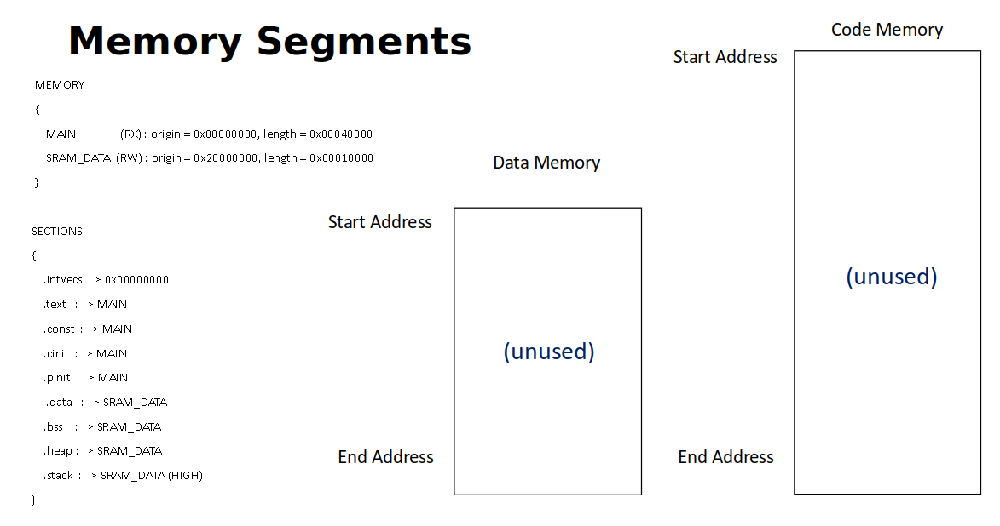

- We will discuss memory section in more details in week 3.
- If we want to see how exactly the memory allocation is done, we can provide the `-map` flag with the linker in order to produce a memory map file containing information about how all memory regions and segments are used and allocated, it also provides us with specific addresses for the allocations
- The following image contains some important flags regarding the linking and locating process:

- After the linking and locating process is successfully done, an output executable will be generated and ready to get installed on the target, the format of this executable file varies depending on the installer and the architecture. Some of those formats are:
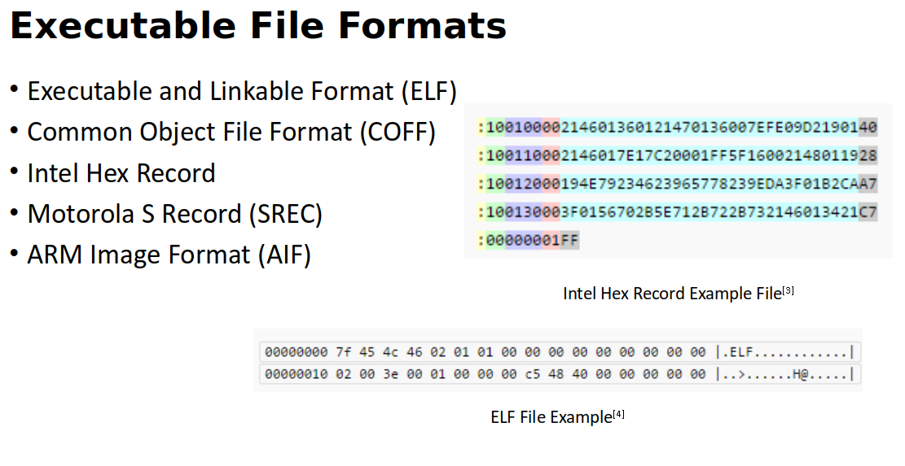
