# **In the name of Allah the Merciful**

# Week 3 - Memory Types, Segments, and Management

## Week Objectives
> - Analyze the components of a program's memory space for both code and data regions  
> - Write C programs to define data in different memory regions  
> - Interpret application's map and linker files   
> - Use GCC binary utilities to investigate the memory usage of an executable  
> - Investigate the map file for the memory usage for an executable  
> - Determine where compiled code and data symbols are allocated, the lifetime of these symbols and the access restrictions  

## Table of Contents
* [Introduction to Memory Organization](#--)
* [Memory Architectures](#--)
* [Memory Segments](#--)
* [Data Memory](#--)
* [Special Keywords (Const, Extern, Static)](#--)
* [The Stack](#--)
* [The Heap](#--)
* [Code Memory](#--)

## Introduction to Memory Organization
- Memory is a key component in embedded systems and generally in all computer systems, but in embedded systems, memory is also one of the major limited resources we have
- The fundamental building block of memory is the *bit*, a bit can store one piece of boolean information (either one or zero)
- Typically, 8 bits make up a *byte*, bytes are usually the minimum unit we can access in hardware.
- Embedded systems have very small amounts of memory (from kilobytes to a few megabytes), that's why it's crucial to utilize and organize memory efficiently in embedded systems
- Embedded systems contain many memory architectures, each type of them is usually a different kind of technology, different types have varying:
  - Capacities
  - Power
  - Speed/latency
  - The way data is stored
  - Volatility
  - Lifetime
  - Transaction size (data width)
  - Price
- Because of the previous note, systems are usually designed with a mixture of different memories. The memory system can be thought of as a pyramid as shown in the following picture, the top is the most expensive but fastest (lowest latency) memory and smallest capacity, the pyramid bottom is the most cheap but slowest and largest capacity

- Chipset vendors usually design multiple chips in a sub-family series all with varying amounts of memory (these memories do not typically list the peripheral or register memory, it's just the flash and RAM memories that vary in the sub-family), consider the following example:

- From the above picture, we notice that usually the RAM memory is smaller than flash, this is because the flash memory contains the *program code* and SRAM contains the *program data* which is always smaller in size than the code itself as program data is typically overwritten during the many iterations of the program.
- When choosing the microcontroller, we should do some amount of effort to properly determine the required memory size and figure out the suitable memory footprint.
- In the previous week, we knew that memory plays an important role in the build and address allocation processes, we knew that the build system requires some information regarding the **architecture** (CPU architecture) and the **platform** (the microcontroller platform) as well as a description of what memory regions are that is provided in the linker script.

- Memory is used to store all of the program code, program data and the runtime state of the program, the linker script is the file responsible for providing the information (memory map) about the segment and sub-segment code to memory mapping.
- In other words, linker script purpose is:
  - To describe how the sections in the input files should be mapped into the output file
  - To control the memory layout of the output file.
- The flash and RAM memory need some type of dedicated controller to configure, read, and write data (these controllers are usually built into the microcontroller and communicate to the CPU via an internal bus)
- We may want to extend the memory by using an external EEPROM which can store both non-volatile code and data memory, usually EEPROM communicates with the processor using SPI protocol.
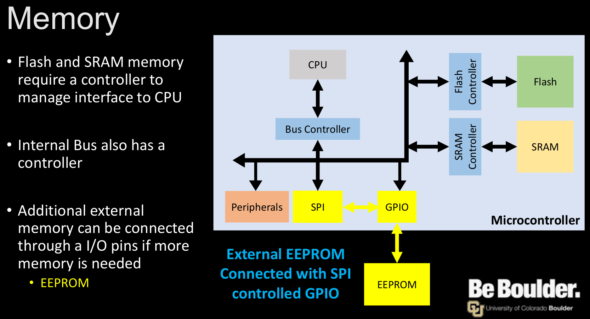

- In addition to code and data memory, we have runtime data that are varying throughout the program, this kind of data is stored and accessed by *register memory* and this memory lives all over the microcontroller (we usually have registers in peripherals, CPU, ...)
- Generally, registers hold data that is used by the CPU and the peripherals to store runtime information or the state of the program, however these are a few registers.
- The CPU registers (general or special purpose) are a key component to how the microcontroller performs an operation.
- General purpose registers store the CPU instructions, and the operands of the operation
- Special purpose registers dictate the state of the program (e.g.: the current instruction, the program counter, ...), they also may be more internal registers that are not accessible to the programmer.
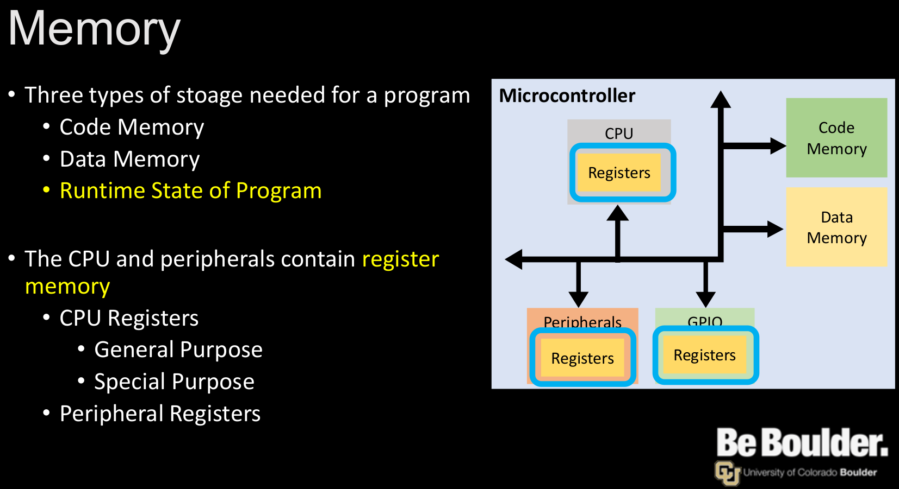

- The faster we want the memory to be, the closer to processor we need to place (i.e.: registers and cache memories are the closest from CPU due to their high speed)
- We usually build a hierarchy of memory systems to help achieving our requirements
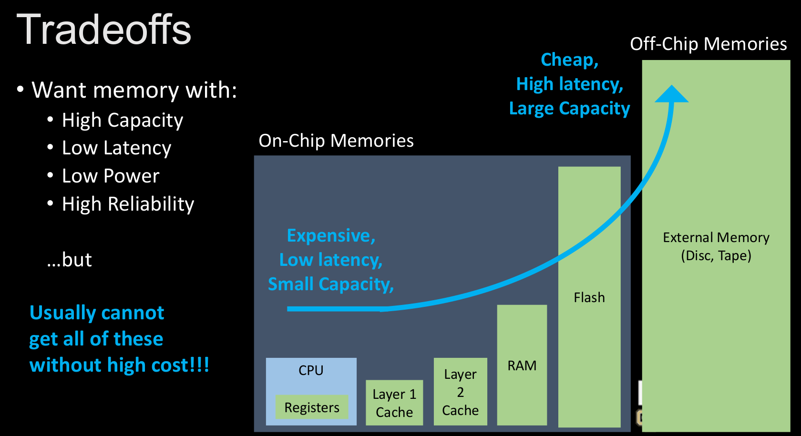

## Memory Architectures
- Memory is usually modeled as a long 2D-array, each row index represents a different memory address and each column index represents different bytes

- Data is read or written to memory based on some types of protocols or handshaking, this handshaking is managed by a *memory controller* that interfaces between the memory and the CPU

- We now discuss the features of memory in more details, those features are:
  - Capacity
  - Volatility
  - Write endurance
  - Memory access
  - Latency
  
### Capacity
- Capacity is the amount of storage a memory can hold
- Our desire to increase memory capacity doesn't mean that with high capacity the system will be improved in performance or quality
- More memory capacity means more design complexity and more physical size which ofcourse leads to more power consumption and price
- That's why we don't need larger capacities for small apllications, but when we work on complex applications with embedded OS, it is crucial to increase memory capacity to do the job.

### Volatility
- It is the ability of memory to store data without power
- We have 2 types of memory:  
| Test           | Volatile                                                        | Non-volatile                                          |  
| -------------- | :-------------------------------------------------------------: | ----------------------------------------------------: |  
| Characteristic | it requires power to store data and loses data when power-off   | it keeps the data stored when the power is removed    |  
| Examples       | RAM and most registers                                          | ROM and flash                                         |  

### Write Endurance
- Non-volatile memories have a limited number of write-erase cycles before failure, meaning that they can't be programmed for infinite number of times 
- Flash has an endurance lasting from 10000 to 100000 write-erase cycles, newer technologies may have higher cycles but endurance still remains an issue.
- Cloud storage has begun to shift towards large flash arrays because of its improved endurance and high speed compared to disk or tape.

### Memory Access
- Random access: the ability to access any part of memory given the address of that location (example: RAM)
- Random access is very convenient for data that need to change regularly like the program data
- However, reducing the access to certain types of memory is desireable as we want some other data to be protected from being overwritten just as the program code 
- Since ROM is read only memory, it can protect the data we want as ROM needs extra permissions to modify or overwrite its data, thus providing security for the software and also safety for potential errors with overwriting
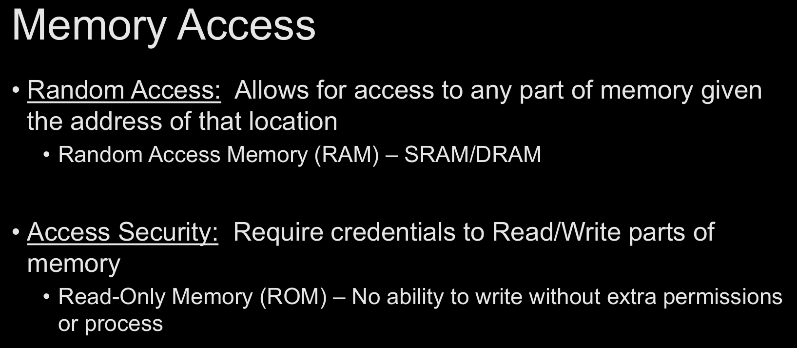

- Memory consists of blocks, each block consists of multiple pages, each page contains multiple bytes
- RAM allows access down to the byte level, as for some flash based memories they don't allow for random access of data, instead they access the pages.
- Flash **erasing** happen at the block level (not the page level)
- Because of this it its necessary that we build some technology around flash to cache information into registers in order to reduce frequently reading or writing information which in turn helps us reducing memory latencies

### Latency
- It's the time it takes for memory to respond to a read/write request
- We know that for each instruction the CPU make its *fetch/decode/execute* process, we want this process to be as fast as possible in order not to cause delay in our application.
- We can further reduce memory latency by using the technology of pipelining (specially in cache), many microcontrollers are now supporting pipelining for that reason.
- A cache is a type of memory to help reducing the time it takes to read/write data from/to the CPU as it's faster than RAM.
- Cache memory may not exist in the simple and cheap microcontrollers. However, more advanced ARM processors like the ARMv8A contain multi-level cache systems

## Memory Segments
- As we already know, embedded systems contain different physical memories:
  - Flash: usually contains the code memory
  - SRAM: contains data memory
  - Registers: help configuring and tracking the state of the peripheral or CPU
  - External memory: we may have it if we need to extend our memory space
- The *linker* is the process that is responsible for taking the high level program and separating it out onto multiple components, each one is installed on a different section on the pyhysical memory, so programs need to know some details about these memories before they can be installed and executed.
- Before we proceed, we want to distinguish between a *patform* and an *architecture*.
  - A platform is the underlying integrated circuit and the components surrounding the CPU (i.e.: the microcontroller itself), it also may refer to an OS. The compiler is **platform independent**
  - An architecture or (target architecture) is the CPU architecture. The compiler is **architecture dependent**
  - However, *linkers* cannot be platform independent as they must have information about the memory space of the platform in order to be able to combine the multiple object files into a single executable, this executable is then mapped into physical memory of the system by the *locating* process.
  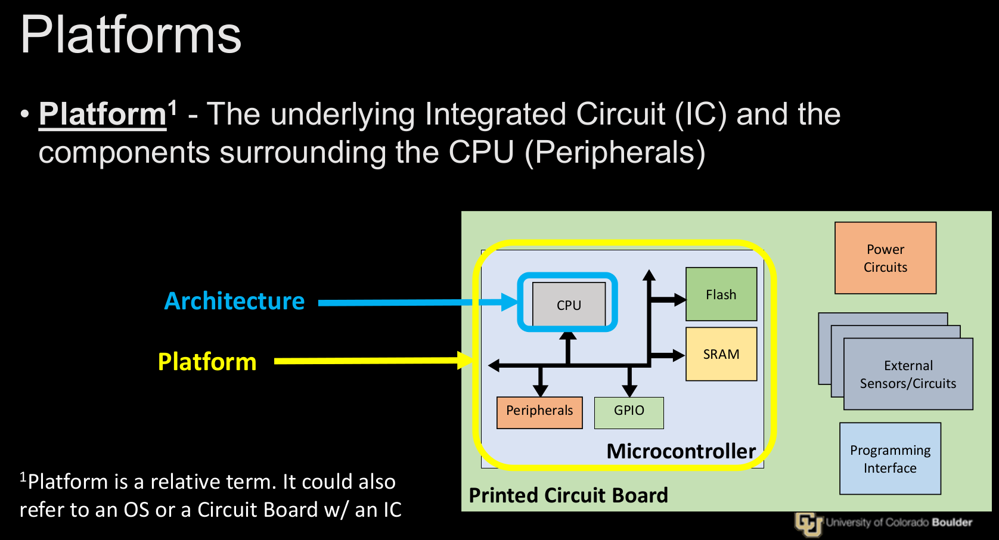
  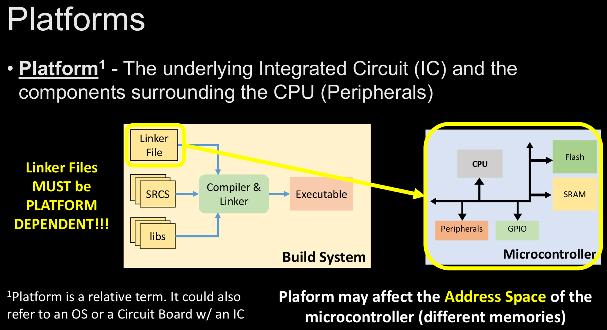

- Memories are placed in physically different parts of the platform, but are accessed in the same way
- One way to organize these memories is to use a *memory map*, it provides us a way to map different segments and sub-segments to the target memory. These are mapped by assigning certain addresse range for each segment in the address space (i.e.: code, data, system configuration, device information, and peripheral functionality are all **represented into different segments but in one address space**)

- However, the general and special purpose registers have their own address space and access method (through *register memory*)
- An example of register memory and the associated segments in the ARM Cortex m architecture is shown below:
  - The processor has specific rules about how general purpose and special purpose registers in the CPU are used
  - Nearly all operations in the CPU utilize the **general purpose registers** to hold operands or the inputs and outputs of an operation that is specified in the assembly code. In our examples we have R0-R12 general purpose registers
  - The status and progress of the program operations are stored in the **special purpose registers**, these registers are accessed via special keywords in assembly. Special purpose register are the stack pointer and program counter
  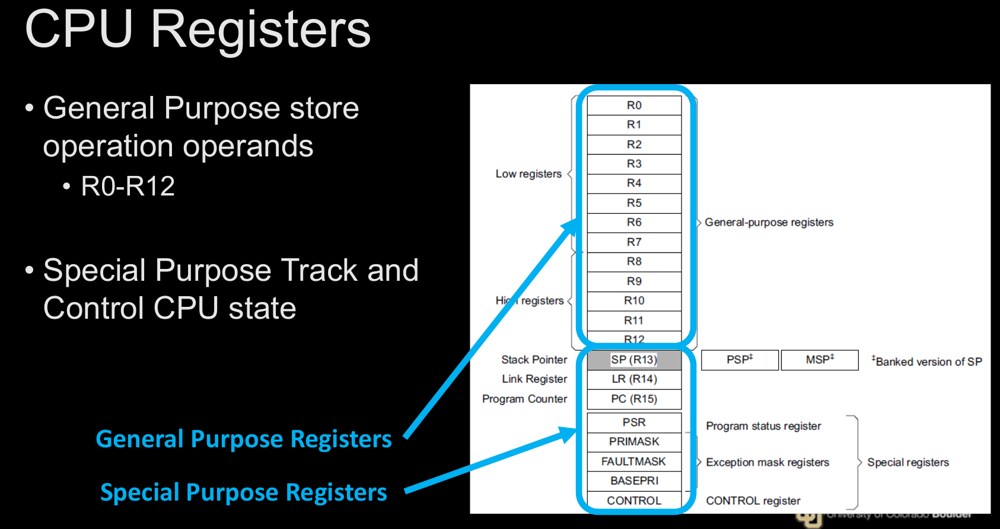

- To further complicate the usage of special purpose registers, different architectures like AVR may use keywords to interact with these registers
- The instantaneous values of these registers change regularly as the program processes the instructions and data of the program
- Compiler needs to know how to manipulate these registers at compile time to make sure the process and interactions with these registers coincide with the architecture's application binary interface (ABI).
- We mentioned ABI earlier in week 2 when we were talking about the toolchain. ABI gives rules on how a compiler will perform the translation from high level language to the architecture specific machine code, this includes details on how to appropriately use the CPU and its registers.
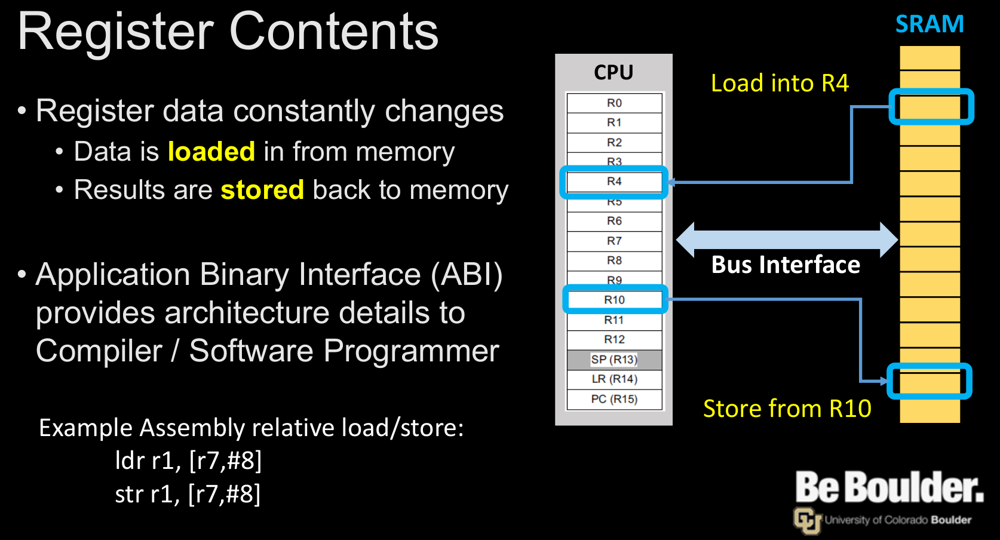

- Different chipsets that in the same microcontroller family use the same CPU architecture but with varying amounts of platform capability like more peripherals, different memory sizes, or more advanced system control.
- The addresses of memory segments may be kept consistent across different chips in the same family, but do not guarantee these memories mainatin the same addresses. This consistency allows the compiler to represent these segments in a unified mechanism
- This means that the compiler doesn't need to know anything related to the platform itself, it just needs the addresses that it needs to read and write to access the peripherals (not the physical addresses, just virtual addresses which can be handled using **pointers**)
- This memory map is provided in the linker script.
- As for the register memory, we also need to map between the code and these platform specific registers at compile time, this occurs in something called *register definition file* which allows address translation for external CPU segments to occur before linking.
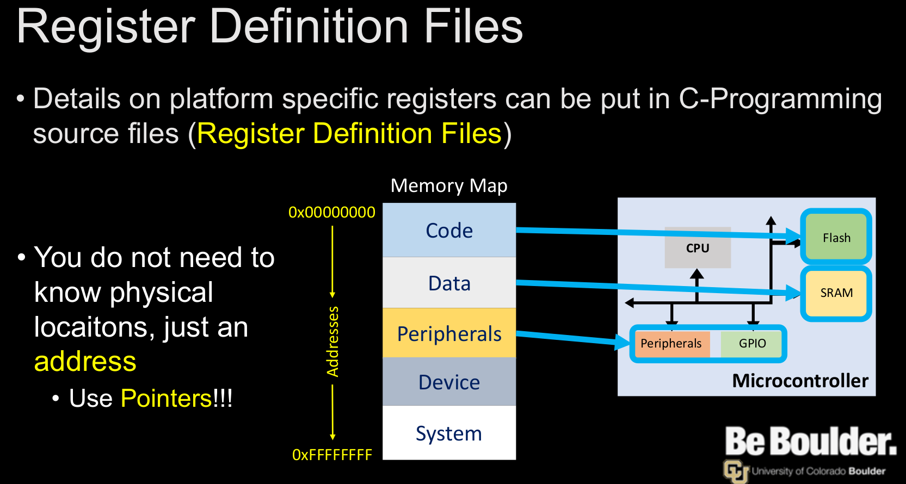

- The linker file provides information to the compilation process about how an executable is to be installed into a platform
- To prevent inconvienience, lets simply compare between the memory map and linker file:
  - Memory map: allows access to the platform through addresses.
  - Linker file: provides physical addresses to symbol mapping.
- By using symbols and offsets, code and data sections can be moved around easily and represented by a generic subsegment name as shown in the following picture:
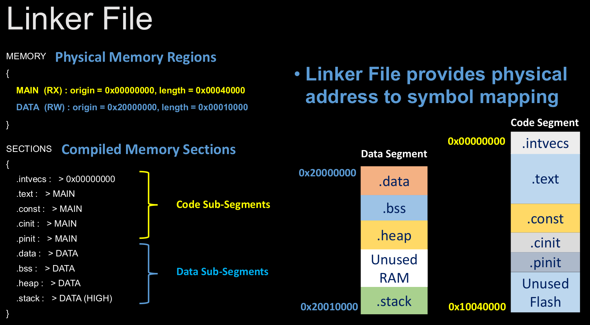

- Then the locator takes these generic sections and gives them real addresses within a larger segment:
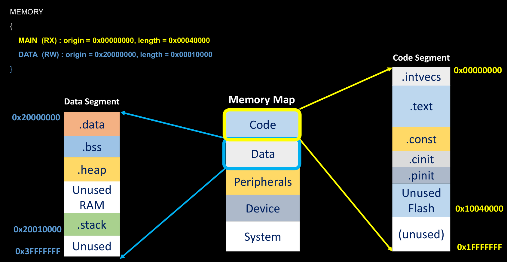

- Ofcourse different applications use varying amounts and sizes of the code and data segments, but any leftover memory in the specified segments just stay unused.
- In linker file, we have a list of **memory segments (memory regions)** and **memory sections (or memory subsegments)**
- Some typical data subsegments are: stack, heap, .data, and .bss
- Some typical code subsegments are: interrupt vectors (.intvecs), .text, .const (or .rodata), and the bootloader

- In the remaining discussion, we will dive more deeply into the data and code sections.

## Data Memory
- Data memory is the container for the various types of allocated data that get mapped into physical memory
- Variables, derived data types such as pointers and structures, and arrays get stored in data memory.
- The contents of data memory regularly change throughout the program's execution, data is *loaded* from memory to CPU registers and is *stored* from registers to memory
- Some data are allocated in compile time, some others allocated in runtime.

- Data memory is broken up to 4 main subsegments, each varies with size depending on the program:
  - Stack
  - Heap
  - .data
  - .bss (block started by symbol)

- The stack stores temporary data in most local variables
- Heap stores dynamic data at runtime
- .data region stores non-zero initialized global and static data
- .bss stores zero initialized and uninitialized global and static data
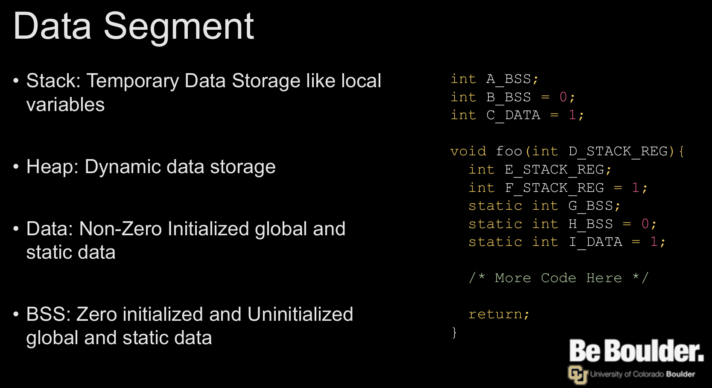

- Consider the following linker script:
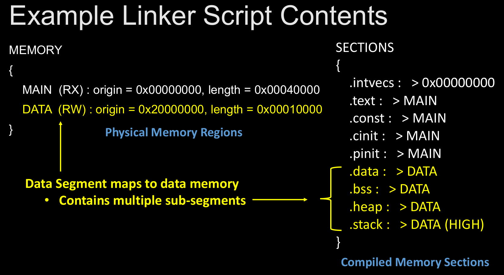

- The "DATA" segment (region) specified in the file maps the physical data region of RAM type memory and have a length of 64 KB (0x0001000 = 64 KB)
- Without carefully managing these data subsegments (sections), data will be easily corrupted by mis-addressing a variable or writing outside the bound of the subsegment space, so take care while working with linker scripts.
- The linker script also specifies in what order the data subsegments will be placed so that each subsegment has boundaries given either by a *linker flag* or by the size of the memory we allocated. This order is the order of the subsegments in the "SECTIONS" region in the linker file.
- The same applies on the "CODE" segment

- It's highely likely that not all the memory will be allocated at compile time, this will leave some leftover memory **unsued** for our program.
- As we can see from the example in the above picture, data subsegments are allocated contiguously starting from the *origin* of addresses and going for the *length* of the memory, except for the stack as it starts from the end of memory region (highest address) and it grows towards the lower addresses as more data gets added to it. This type of stack is specified as **"full descending stack"**
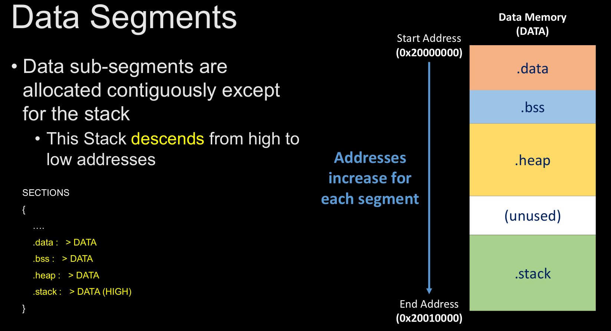

- There are many different characteristics that variables can have throughout the program:
  - Size
  - Access
  - Scope
  - Location
  - Creation time (allocation time)
  - Lifetime
- We can allocate and manage our data with some specific C keywords, or with *compiler attributes*, there are also some runtime routines that help us allocate data at runtime

- Data sizes are architecture and compiler dependent, the C standards specifies the minimum size that some types must be, but the compiler and the architecture can manipulate types differently
- Lifetime and scope of data are somewhat related to each other, there are 3 forms of lifetime:
  - Data exist for a lifetime of the function or block in which it's inside
  - Data exist for a lifetime of the program
  - Data exist for a longer time than a function lifetime and less than the program lifetime
  
- Most local variables only exist for the length of the function or block, then when the function returns, they are destroyed. These variables have also *local scope* which means that they are only accessible inside the funtion. The memory that these variables occupy is reused by the other functions after the existing function returns.
- The only local variables that are exception from the latter note is those which are created with the `static` keyword. We will discuss it further in the next lesson.
- Global variables are that **get allocated at compile time**, they've the lifetime of the entire program and are never destroyed, which means that the occupied memory can never be reused during the program runtime, they also have *global scope* so that they are accessible by other parts of the program
- Dynamically allocated data are the data that can live for a longer time than a function and less than a program, these data require a special routine to **allocate and free data an runtime**. There are many issues of managing dynamic memory but it can provide us the ability to access data outside of a local scope

- One issue with data memory is that data is stored in RAM, meaning that this data it's lost when power is off causing loss in the state and important processes of the program. We can solve this problem by storing important data in the Flash as it's non-volatile memory, but it's difficult and also slow to write data into flash during the execution of the program, so we use the external EEPROM to store the data that needs to be retained if the power is shutdown.
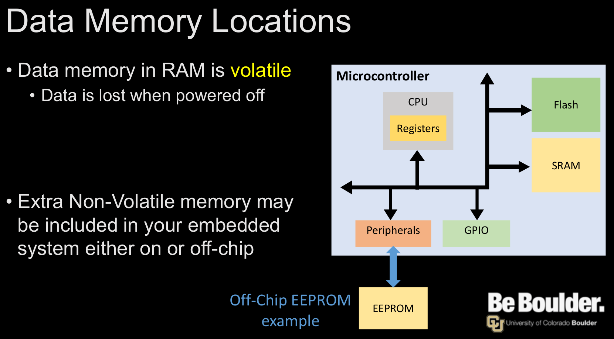

- For local variables that are initialized, their initial values are stored in the non-volatile memory and are copied to the RAM at the beginning of the program execution or the function.

## Special Keywords (Const, Extern, Static)
- We will discuss some special keywords that affect data allocation in the data segment, these include:
  - Variable types
  - Type qualifiers
  - Type modifiers
  - Storage classes
  
### Variable Types
- These tell the compiler exactly how much space does this data need to be stored, and in case of certain types (like float variable), how that data should be formatted
- Derived types like arrays and structures can be used but they are implementation-dependent, meaning that depending on the types they are defined with will affect the overall size
- Pointers and enumerated types have a size that is dependent on the architecture itself
- There are some special keywords for different C standards to define certain types like the Bool, Complex, and Imaginary in **C99**
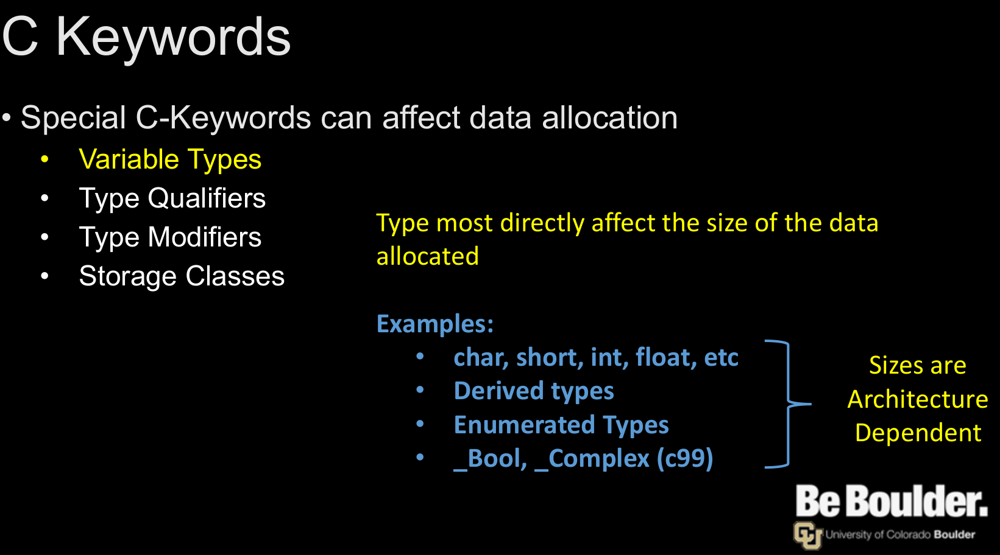

### Type Qualifiers
- The most important type qualifier in embedded systems is **const**
- Const keyword specifies that the associated data will be constant and will be stored in the **read-only memory**, so it can't be changed by the traditional methods
- This read-only data is stored in the **code memory** in the **.const (or .rodata)** subsegment
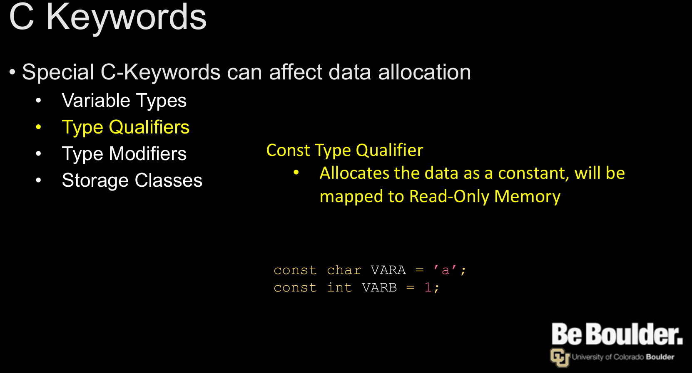
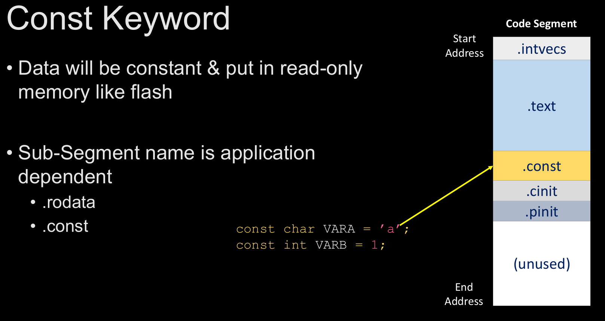

### Type Modifiers
- These type modifier may control the **size and the sign** of a particular datatype
- Altering the sign changes the range of values a datatype can represent
- Altering the size changes the size of memory that the datatype is allocated for, for example: the ARM architecture specifies that `short int` will occupy 2 bytes, a `long int` will occupy 4 bytes, and `long long int` occupy 8 bytes

### Storage Classes
- These tell the compiler what the **lifetime and scope** should this data have in the program
- We've 4 storage classes: `Auto`, `static`, `extern`, and `register`.

- The `auto` storage class is the default storage class for local variables, it tells the compiler to automatically allocate and de-allocate this data on the stack.
- It's trivial to write `auto` to our local variables as they are already auto by default.

- The `static` keyword for variables tells the compiler that this data should **remain for the lifetime of the program** but the difference between the static variables and global variables is **the static variable is not accessible unless in its own function**, static data can be stored in the *.data* section if it's non-zero initialized or in the *.bss* if it's non-initialized or zero-initialized. (To sum up: static variable has a lifetime of a program but a local scope of access)
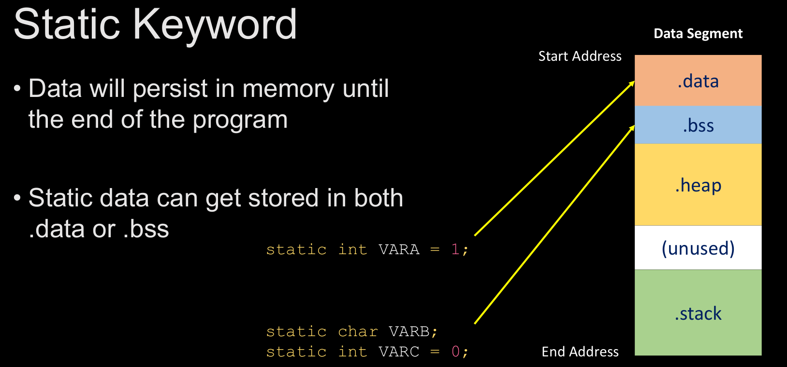

- The `static` funtion is a function that is not accessible outside its own file. (i.e.: we can't call it in another file)

- The `extern` keyword **allows for a variable definition to exist outside the current scope of access**, this means that a local variable can be externally defined in another file. Global variables are accessible by the file that has defined them, but if you want to use a global variable defined in another file we must provide the `extern` declaration of that variable so that the compiler knows that this variable is defined elsewhere

- The `register` keyword makes a request to the compiler to allocate this variable in the CPU registers as they are the fastest memory in our system. However, this is just a guideline for the compiler which the compiler can deny if it sees another operation needs to be put in this CPU register.
- This keyword is not used very commonly as the compiler usually can optimize the registers use better than a programmer.
- Some architectures like ARM will try to allocate a small number of local variables and funtion paramaters directly in the registers to reduce overhead associated with interacting with the stack.
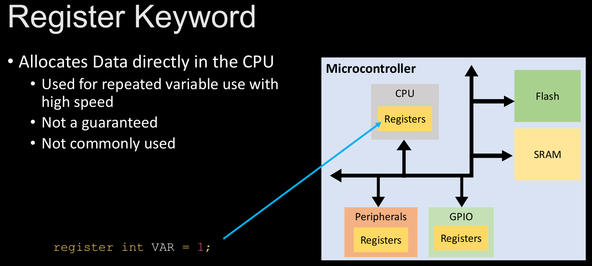

- 
