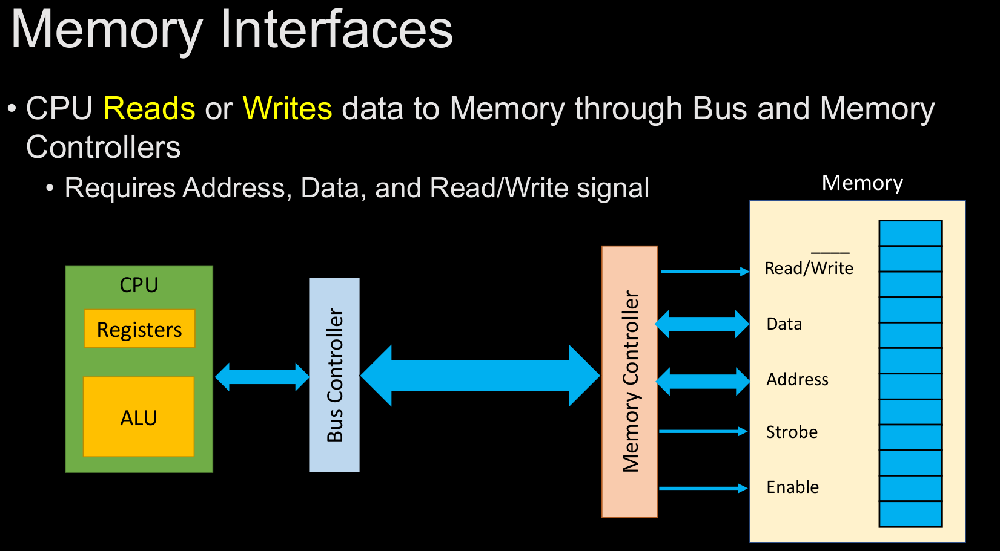
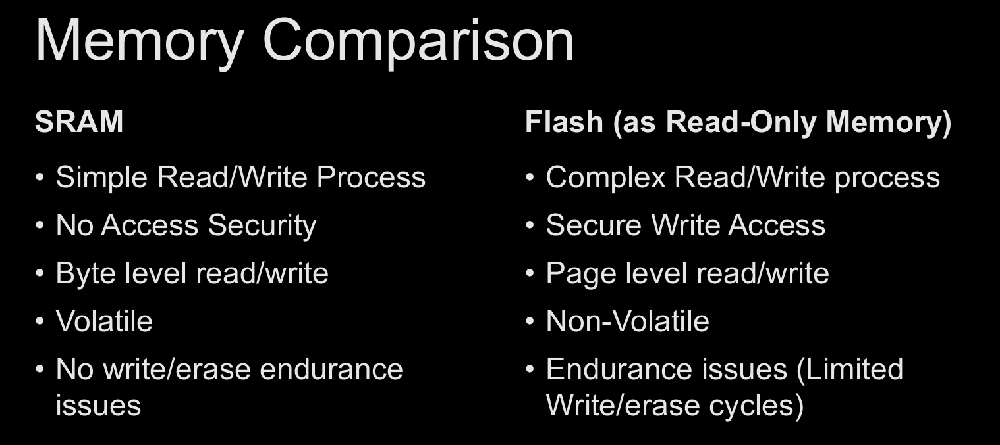
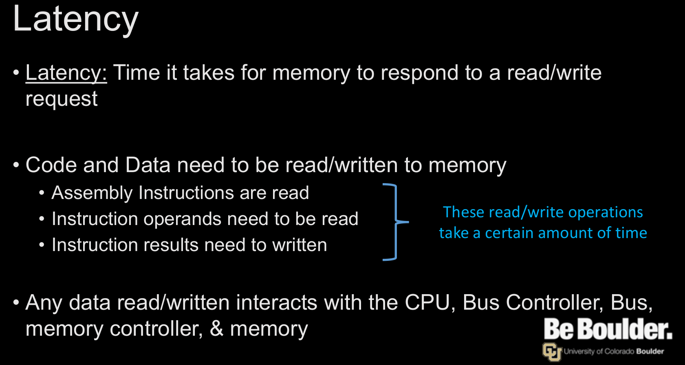

# **In the name of Allah the Merciful**

# Week 3 - Memory Types, Segments, and Management

## Week Objectives
> - Analyze the components of a program's memory space for both code and data regions  
> - Write C programs to define data in different memory regions  
> - Interpret application's map and linker files   
> - Use GCC binary utilities to investigate the memory usage of an executable  
> - Investigate the map file for the memory usage for an executable  
> - Determine where compiled code and data symbols are allocated, the lifetime of these symbols and the access restrictions  

## Table of Contents
* [Introduction to Memory Organization](#--)
* [Memory Architectures](#--)
* [Memory Segments](#--)
* [Data Memory](#--)
* [Special Keywords (Const, Extern, Static)](#--)
* [The Stack](#--)
* [The Heap](#--)
* [Code Memory](#--)

## Introduction to Memory Organization
- Memory is a key component in embedded systems and generally in all computer systems, but in embedded systems, memory is also one of the major limited resources we have
- The fundamental building block of memory is the *bit*, a bit can store one piece of boolean information (either one or zero)
- Typically, 8 bits make up a *byte*, bytes are usually the minimum unit we can access in hardware.
- Embedded systems have very small amounts of memory (from kilobytes to a few megabytes), that's why it's crucial to utilize and organize memory efficiently in embedded systems
- Embedded systems contain many memory architectures, each type of them is usually a different kind of technology, different types have varying:
  - Capacities
  - Power
  - Speed/latency
  - The way data is stored
  - Volatility
  - Lifetime
  - Transaction size (data width)
  - Price
- Because of the previous note, systems are usually designed with a mixture of different memories. The memory system can be thought of as a pyramid as shown in the following picture, the top is the most expensive but fastest (lowest latency) memory and smallest capacity, the pyramid bottom is the most cheap but slowest and largest capacity

- Chipset vendors usually design multiple chips in a sub-family series all with varying amounts of memory (these memories do not typically list the peripheral or register memory, it's just the flash and RAM memories that vary in the sub-family), consider the following example:

- From the above picture, we notice that usually the RAM memory is smaller than flash, this is because the flash memory contains the *program code* and SRAM contains the *program data* which is always smaller in size than the code itself as program data is typically overwritten during the many iterations of the program.
- When choosing the microcontroller, we should do some amount of effort to properly determine the required memory size and figure out the suitable memory footprint.
- In the previous week, we knew that memory plays an important role in the build and address allocation processes, we knew that the build system requires some information regarding the **architecture** (CPU architecture) and the **platform** (the microcontroller platform) as well as a description of what memory regions are that is provided in the linker script.

- Memory is used to store all of the program code, program data and the runtime state of the program, the linker script is the file responsible for providing the information (memory map) about the segment and sub-segment code to memory mapping.
- In other words, linker script purpose is:
  - To describe how the sections in the input files should be mapped into the output file
  - To control the memory layout of the output file.
- The flash and RAM memory need some type of dedicated controller to configure, read, and write data (these controllers are usually built into the microcontroller and communicate to the CPU via an internal bus)
- We may want to extend the memory by using an external EEPROM which can store both non-volatile code and data memory, usually EEPROM communicates with the processor using SPI protocol.

- In addition to code and data memory, we have runtime data that are varying throughout the program, this kind of data is stored and accessed by *register memory* and this memory lives all over the microcontroller (we usually have registers in peripherals, CPU, ...)
- Generally, registers hold data that is used by the CPU and the peripherals to store runtime information or the state of the program, however these are a few registers.
- The CPU registers (general or special purpose) are a key component to how the microcontroller performs an operation.
- General purpose registers store the CPU instructions, and the operands of the operation
- Special purpose registers dictate the state of the program (e.g.: the current instruction, the program counter, ...), they also may be more internal registers that are not accessible to the programmer.

- The faster we want the memory to be, the closer to processor we need to place (i.e.: registers and cache memories are the closest from CPU due to their high speed)
- We usually build a hierarchy of memory systems to help achieving our requirements

## Memory Architectures
- Memory is usually modeled as a long 2D-array, each row index represents a different memory address and each column index represents different bytes

- Data is read or written to memory based on some types of protocols or handshaking, this handshaking is managed by a *memory controller* that interfaces between the memory and the CPU

- We now discuss the features of memory in more details, those features are:
  - Capacity
  - Volatility
  - Write endurance
  - Memory access
  - Latency
  
### Capacity
- Capacity is the amount of storage a memory can hold
- Our desire to increase memory capacity doesn't mean that with high capacity the system will be improved in performance or quality
- More memory capacity means more design complexity and more physical size which ofcourse leads to more power consumption and price
- That's why we don't need larger capacities for small apllications, but when we work on complex applications with embedded OS, it is crucial to increase memory capacity to do the job.

### Volatility
- It is the ability of memory to store data without power
- We have 2 types of memory:
|    | Volatile | Non-volatile |
| -------------- | ------------------------------------------------------------- |----------------------------------------------------|
| Characteristic | it requires power to store data and loses data when power-off | it keeps the data stored when the power is removed |
| -------------- | ------------------------------------------------------------- | -------------------------------------------------- |
| Examples | RAM and most registers | ROM and flash |
| -------------- | ------------------------------------------------------------- | -------------------------------------------------- |

### Write Endurance
- Non-volatile memories have a limited number of write-erase cycles before failure, meaning that they can't be programmed for infinite number of times 
- Flash has an endurance lasting from 10000 to 100000 write-erase cycles, newer technologies may have higher cycles but endurance still remains an issue.
- Cloud storage has begun to shift towards large flash arrays because of its improved endurance and high speed compared to disk or tape.

### Memory Access
- Random access: the ability to access any part of memory given the address of that location (example: RAM)
- Random access is very convenient for data that need to change regularly like the program data
- However, reducing the access to certain types of memory is desireable as we want some other data to be protected from being overwritten just as the program code 
- Since ROM is read only memory, it can protect the data we want as ROM needs extra permissions to modify or overwrite its data, thus providing security for the software and also safety for potential errors with overwriting

- Memory consists of blocks, each block consists of multiple pages, each page contains multiple bytes
- RAM allows access down to the byte level, as for some flash based memories they don't allow for random access of data, instead they access the pages.
- Flash **erasing** happen at the block level (not the page level)
- Because of this it its necessary that we build some technology around flash to cache information into registers in order to reduce frequently reading or writing information which in turn helps us reducing memory latencies

### Latency
- It's the time it takes for memory to respond to a read/write request
- We know that for each instruction the CPU make its *fetch/decode/execute* process, we want this process to be as fast as possible in order not to cause delay in our application.
- We can further reduce memory latency by using the technology of pipelining (specially in cache), many microcontrollers are now supporting pipelining for that reason.
- A cache is a type of memory to help reducing the time it takes to read/write data from/to the CPU as it's faster than RAM.
- Cache memory may not exist in the simple and cheap microcontrollers. However, more advanced ARM processors like the ARMv8A contain multi-level cache systems

